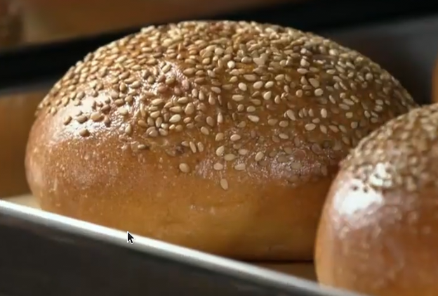

# American burger

## Ingredienti

| Ingredienti                  | Ingredienti             |
| ---------------------------- | ----------------------- |
| **800 g** - Farina 0 | **25 g** - Zucchero |
| **200 g** - Farina 0 | **20 g** - Miele |
| **15 g** - Lievito di birra fresco | **25 g** - Sale |
| **550 g** - Acqua | **120 g** - Uova (2) |
| **50 g** - Burro | **100 g** - Semi di sesamo |

## Procedimento

> Preriscaldare il forno a 240°

1. Nell'impastatrice si mettono entrambe le farine, il lievito, lo zucchero, l'acqua (se ne lascia indietro un po') e le uova
1. Si avvia a velocità bassa (media?) per 10 minuti. Dopo 3 minuti però si aggiunge il miele.
1. Quando l'impasto comincia ad essere più solido si aggiunge l'acqua rimasta e il sale.
1. L'impasto deve essere lavorabile sul tavolo.
1. Nell'impastatrice si aggiunge il burro e si riavvia a velocità bassa per 6/7 minuti. L'impasto deve essere morbido ma asciutto (dovrebbe restare attaccato al gancio).
1. Lo si fa lievitare in una ciotola coperta da pellicola fino al raddoppio del volume.
1. Da ora in avanti l'impasto è delicato e va maneggiato con cura.
1. Si infarina pochissimo il tavolo, si fa cadere l'impasto sul tavolo e lo si divide in 6 parti.
1. Si arrotolano i panini due volte perpendicolarmente, poi si effettua la pirlatura (la pallina)
1. Si mettono i semi di sesamo in una pirofila, si bagnano appena i panini e li si passa sul sesamo.
1. Si lasciano lievitare nuovamente fino al raddoppio.
1. Si inforna a 240 gradi per 10 minuti.

---

<iframe width="560" height="315" src="https://www.youtube.com/embed/PkDq8J0U8rU?si=4Tl1_bgqkNzMElQb" title="YouTube video player" frameborder="0" allow="accelerometer; autoplay; clipboard-write; encrypted-media; gyroscope; picture-in-picture; web-share" referrerpolicy="strict-origin-when-cross-origin" allowfullscreen></iframe>