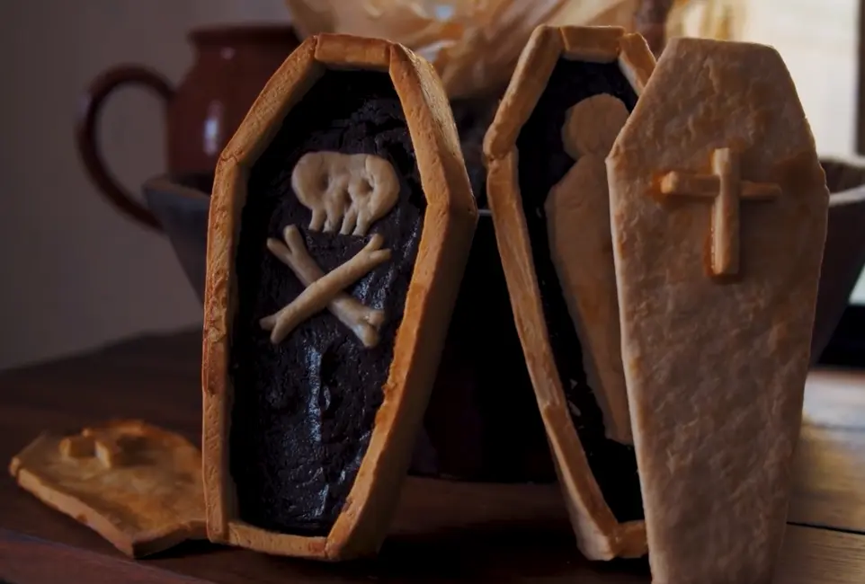

# Bare di halloween

## Ingredienti

| Ingredienti                  | Ingredienti             |
| ---------------------------- | ----------------------- |
| **360 g** - Farina (3 cup) | **2** - Uova |
| **1 teaspoon** - Sale | Cannella |
| **227 g** - Acqua (1 cup) | Noce moscata |
| **227 g** - Burro (1 cup) | |

## Procedimento

> Preriscaldare il forno a 180°

1. Si fa bollire il burro con l'acqua
1. Si mescola alla farina e si impasta
1. Finche è tiepido si aggiunge un uovo
1. Si stende (6/7 mm) e si taglia in strisce in base a quello che si deve fare
1. Si lascia riposare per almeno 6 ore in un luogo fresco
1. Si taglia a forma e si può incollare con il rosso d'uovo
1. Si può riempire con quello che si vuole (es: [Chocolate custard](Chocolate-custard-per-torte.md)) + cannella e noce moscata
1. Si spennella di bianco d'uovo
1. Si inforna a 180 gradi per 20/30 minuti\end{step}

<iframe width="560" height="315" src="https://www.youtube.com/embed/biDi70wZw98?si=VoRWZvYiYKeJtuOt" title="YouTube video player" frameborder="0" allow="accelerometer; autoplay; clipboard-write; encrypted-media; gyroscope; picture-in-picture; web-share" referrerpolicy="strict-origin-when-cross-origin" allowfullscreen></iframe>

