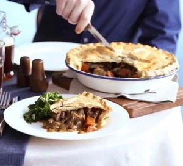

# Beef ale and mushroom pie

{{hi:manzo}}
{{hi:Birra}}
{{hi:Funghi}}

## Ingredienti

**For the beef**

| Ingredienti                  | Ingredienti             |
| ---------------------------- | ----------------------- |
| **10 g** - Dried porcini | Thyme, bay leaf and parsley, bunches tied together |
| **2 tbsp** - Vegetable oil | **4 tbsp** - Plain flour |
| **1 kg** - Braising Steak | **300 ml** - Dark ale |
| **2** - Large onions, roughly chopped | **2** - Beef stock cubes mixed wid **400 ml** water |
| **4** - large carrots, chopped into large chunks | **200 g** - Smoked bacon lardons |
| **2 tsp** - Golden caster sugar | **200 g** - Chestnut mushrooms, halved |

**For the pastry**

| Ingredienti                  | Ingredienti             |
| ---------------------------- | ----------------------- |
| **650 g** - Plain flour | **1** - Egg yolk, beaten, to glaze |
| **250 g** - Lard or cold butter | |

## Procedimento

> Preheat the oven to 220°/200°

1. If you're using the porcini mushrooms, cover 10 g of mushrooms in boiling water for 20 mins, then squeeze out but keep the soaking water.
1. Heat oven to 160\textcelsius/140\textcelsius fan/gas 3. Heat 1 tbsp vegetable oil in a large casserole dish, brown 1 kg large chunks of braising steak really well in batches, then set aside.
1. Add 2 large onions, roughly chopped, and 4 large carrots, chopped into large chunks, to the pan. Add a drizzle more vegetable oil, then cook on a low heat for 5 mins until coloured.
1. Add the soaked porcini mushrooms, sizzle for 1 min more, then scatter over 2 tsp golden caster sugar and 4 tbsp plain flour, stirring until the flour turns brown.
1. Tip the braising steak and any juices back into the pan and give it all a good stir.
1. Pour over 300 ml dark ale, 2 beef stock cubes mixed with 400 ml boiling water and the porcini mushroom soaking liquid, discarding the last few drops.
1. Season the stew, tuck in a small tied-together bunch of thyme, bay leaf and parsley, and bring everything to a simmer.
1. Cover with a lid and place in the oven for about 2 hrs, until the braising steak is really tender.
1. While the stew is cooking, heat a drop more vegetable oil in a frying pan and sizzle 200 g smoked bacon lardons for 3 mins until crisp.
1. Turn up the heat, add 200 g halved chestnut mushrooms and cook for 4 mins until golden. Remove from the heat and, when the stew is cooked, stir them through.
1. Leave everything to cool completely - better still, make this up to 2 days in advance and keep it in the fridge as the pie will be better if the filling is fridge-cold when added. Can also be frozen for up to 3 months and defrosted when needed.
1. Make the pastry up to 2 days before you want to assemble the pie. Crumble 650 g plain flour and 250 g cold diced lard or butter, together with a generous pinch of sea salt until completely combined, then add up to 200 ml ice-cold water to make a soft dough. This can be done in a food processor if you want.
1. Knead the pastry, then wrap in cling film and leave to rest in the fridge for at least 1 hr. The pastry can be made up to 2 days ahead and kept in the fridge or frozen for up to a month.
1. When you want to make the pie, heat oven to 220°/200° fan/gas 7 and place a flat baking tray in the oven. Heavily grease a 24-28 cm pie dish and dust well with flour.
1. Cut a third off the pastry and set aside. Roll out the pastry to a thickish round that will easily line the pie dish with an overhang, then line the tin.
1. Add the braising steak to the dish using a slotted spoon so some gravy is left in the container, as you don't want too much sauce in the pie. You want the filling to be slightly higher than the rim of the dish. If you have a bit too much, set it aside.
1. Roll out the remaining pastry to a thick round big enough to cover the dish. Brush the edges of the pastry in the dish with 1 beaten egg yolk, then cover with the pastry lid.
1. Trim the edges, crimp the pastry, then re-roll your trimmings to make a decoration, for example, pastry leaves. Brush the top heavily with egg. Make a few little slits in the centre of the pie, place on the hot baking tray.
1. Bake for 40 mins until golden. Leave the pie to rest for 10 mins while you heat up the gravy left in the container. Serve the pie at the table with a jug of gravy and a big pile of greens.
