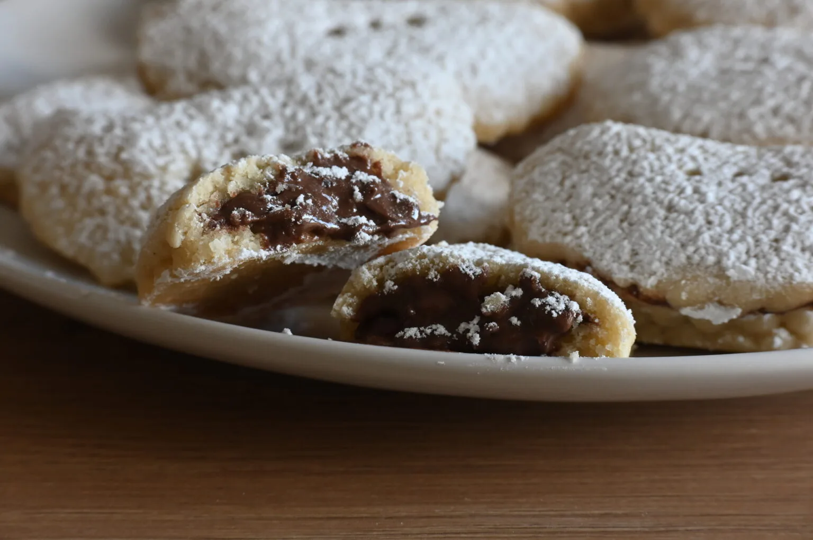

# Biscotti Ripieni Ricotta e Nutella

{{hi:Ricotta}}
{{hi:Nutella}}

## Ingredienti

| Ingredienti                  | Ingredienti             |
| ---------------------------- | ----------------------- |
| **600 g** - Pastafrolla | **200 g** - Nutella |
| **200 g** - Ricotta | Zucchero a velo |

## Procedimento

> Preriscaldare il forno a 170°

1. Prendiamo la pasta frolla e sistemiamola sul piano da lavoro. Mettiamola tra due fogli di carta forno e stendiamola per l’altezza di qualche millimetro.
2. Con il taglia biscotti ricaviamo diverse forme fino a terminare la pasta frolla.
3. Una volta ottenuti i cerchi mettiamo al centro un po’ di ricotta e aggiungiamo un po’ di nutella.
4. Chiudiamo a mezza luna fermando con una forchetta i bordi.
5. Mettiamo le mezze lune su una teglia coperta da carta forno leggermente distanziate tra loro e con una forchetta buchiamo la superficie.
6. Inforniamo a 180° statico oppure 170° ventilato per 18-20 minuti.
7. Appena la superficie si sarà leggermente colorata sforniamoli e serviamoli.
