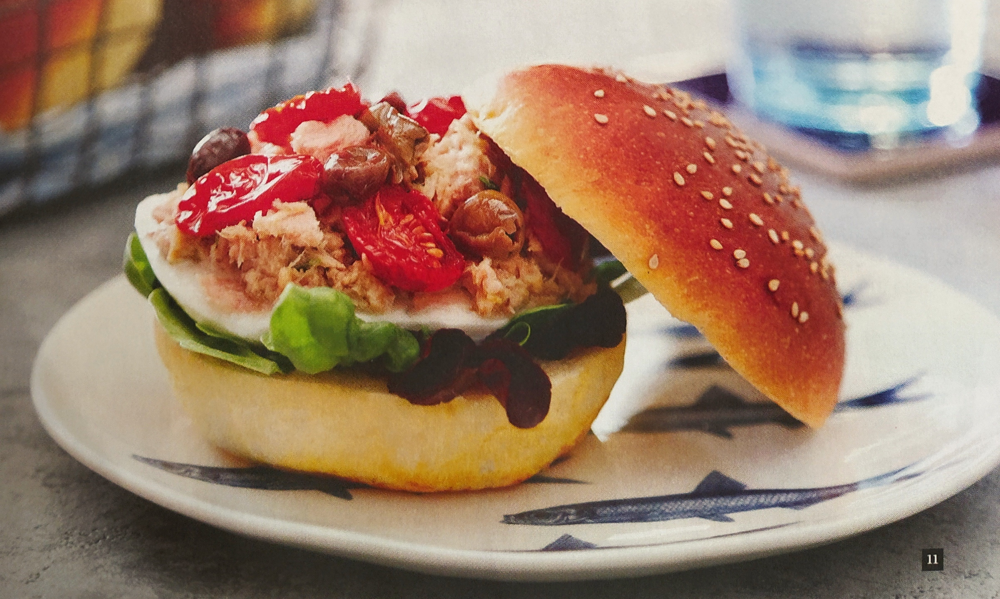

# Bun di tonno

{{hi:Tonno}}
{{hi:Mozzarella}}
{{hi:Olive taggiasche}}

## Ingredienti

| Ingredienti                  | Ingredienti             |
| ---------------------------- | ----------------------- |
| **4** - Bun | Timo |
| **200 g** - Tonno | Olio evo |
| **1** - Mozzarella | Sale |
| **50 g** - Olive taggiasche | Succo di limone |
| **100 g** - Datterini |  |

## Procedimento

> Preriscaldare il forno a 180°

1. Mescolare in una ciotola il tonno e condirlo con il succo di lime, un cucchiaio di olio extra vergine di oliva e un pò di sale. Far riposare.
1. Tagliare a metà i pomodorini, mettere sopra un pò di sale e cuocere in forno per 30 minuti a 180°C.
1. Tagliare a fette la mozzarella.
1. Comporre il panino: uno strato di olive taggiasche, uno di mozzarella, pomodorini al forno e tonno al lime
