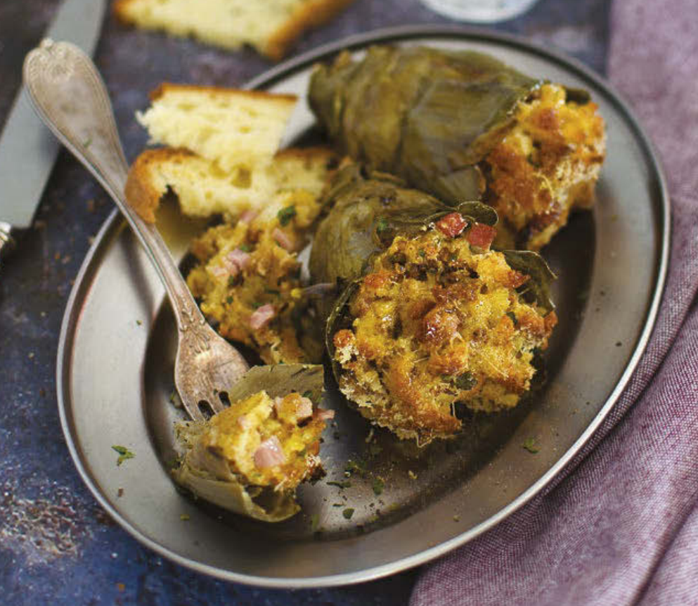

# Carciofi ripieni della nonna

{{hi:Carciofi}}
{{hi:Prosciutto}}
{{hi:Mozzarella}}
{{hi:Parmigiano}}
{{hi:Uovo}}

## Ingredienti

| Ingredienti                  | Ingredienti             |
| ---------------------------- | ----------------------- |
| **8** - Carciofi | **1 ciuffo** - Prezzemolo |
| **500 g** - Mollica di pane raffermo | **1** - Limone |
| **5-6** - Uova | Latte |
| **120 g** - Prosciutto cotto | Olio evo |
| **120 g** - Mozzarella tritata | Sale e pepe |
| **180 g** - Parmigiano grattuggiato | |

## Procedimento

> Preriscaldare il forno a 200°

1. Pulite i carciofi, eliminate le foglie esterne più dure e raccoglieteli man mano in una ciotola con acqua acidulata con succo di limone. Lessateli in acqua bollente e leggermente salata; una volta cotti, scolateli e fateli raffreddare.
1. Mettete la mollica di pane raffermo in ammollo in un pochino di latte per qualche minuto, quindi strizzatela e raccoglietela in una ciotola; aggiungete il prosciutto cotto, tagliato a julienne, la mozzarella e il prezzemolo, tritati, e un pizzico di sale e di pepe. Incorporate le uova, mettendone uno alla volta, e amalgamate fino a ottenere un impasto non troppo morbido.
1. Farcite i carciofi con il composto ottenuto e disponeteli man mano in una teglia da forno. Cospargeteli con il parmigiano grattugiato, irrorateli con un filo di olio e un goccino di acqua e infornate a 200 °C per circa 30 minuti, o comunque finché non saranno ben dorati in superficie. Una volta cotti, sfornate i carciofi, impiattate e servite.
