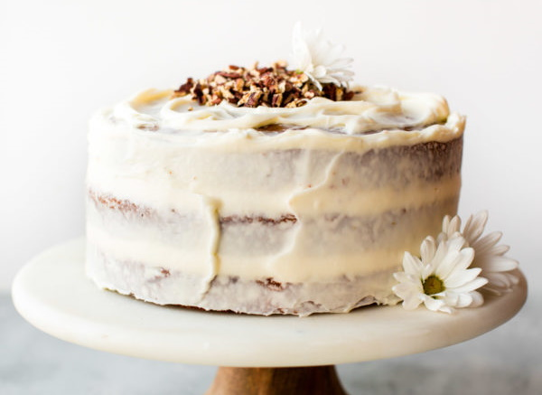

# Carrot cake

## Ingredienti

**Cake**

| Ingredienti                  | Ingredienti             |
| ---------------------------- | ----------------------- |
| **260 g** - Chopped pecan | **2 teaspoons** - Baking powder |
| **300 g** - Light or dark brown sugar | **1 teaspoon** - baking soda |
| **100 g** - Granulated sugar | **\\(\frac{1}{2}\\) teaspoon** - Salt |
| **240 ml** - Vegetable oil | **\\(\frac{1}{2}\\) teaspoon** - Ground cinnamon |
| **4** - Large eggs | **1 teaspoon** - Ground ginger |
| **133 g** - Smooth unsweetened apple sauce | **\\(\frac{1}{4}\\) teaspoon** - Ground nutmeg |
| **1 teaspoon** - Vanilla extract | **\\(\frac{1}{4}\\) teaspoon** - Ground cloves (chiodi di garofano) |
| **312 g** - All purpose flour | **260 g** - Grated carrots (about 4) |

**Frosting**

| Ingredienti                  | Ingredienti             |
| ---------------------------- | ----------------------- |
| **450 g** - Full-fat block cream cheese, softened to room temperature (Philadelphia, mascarpone or quark) | **15 ml** - Heavy cream |
| **115 g** - Unsalted butter, softened to room temperature | **\\(\frac{1}{2}\\) teaspoon** - Pure vanilla extract |
| **540 g** - Confectioners' sugar | **a pinch** - Salt |

## Procedimento

### Cake

> Preheat oven to 300°F (149°C). 

1. Line a large baking sheet with parchment paper or a silicone baking mat. Spread the chopped pecans on the sheet and toast for 7-8 minutes. Remove from the oven and allow to cool for 10-15 minutes.
1. Turn the oven up to 350°F (177°C). 
2. Grease two or three 9-inch cake pans, line with parchment paper, then grease the parchment paper. Parchment paper helps the cakes seamlessly release from the pans.
3. Whisk the brown sugar, granulated sugar, oil, eggs, applesauce, and vanilla together in a large bowl until combined and no brown sugar lumps remain. 
4. In another large bowl, whisk the flour, baking powder, baking soda, salt, cinnamon, ginger, nutmeg, and cloves together. 
5. Pour the wet ingredients into the dry ingredients and, using a rubber spatula or wooden spoon, fold the ingredients together until just combined. 
6. Fold in the carrots and 1 cup of the toasted pecans. (The rest of the pecans are for garnish.)
7. Pour/spoon the batter evenly into the cake pans. If using three cake pans, bake for 20-24 minutes. If using two cake pans, bake for 30-35 minutes. Test the center with a toothpick. If it comes out clean, the cakes are done. If not, continue to bake until cooked through. Do not over-bake. 
8. Allow the cakes to cool completely in the pans set on a wire rack. The cakes must be completely cool before frosting and assembling.

### Frosting

1. In a large bowl using a handheld or stand mixer fitted with a whisk or paddle attachment, beat the cream cheese and butter together on medium-high speed until smooth (about 2 minutes). 
1. Add the confectioners' sugar, cream/milk, vanilla extract, and a pinch of salt. 
1. Beat on low speed for 30 seconds, then increase to high speed and beat for 3 minutes until completely combined and creamy. 
1. Add more confectioners' sugar if frosting is too thin, more milk if frosting is too thick, or an extra pinch of salt if frosting is too sweet. 
2. Frosting should be soft, but not runny.

### Assemble and frost

1. First, using a large serrated knife or cake leveler, layer off the tops of the cakes to create a flat surface. 
1. Place 1 cake layer on your cake stand or serving plate. Evenly cover the top with frosting. 
1. Top with 2nd layer, more frosting, and then top with the 3rd layer. 
1. Spread remaining frosting all over the top and sides. 
1. Decorate the sides and top of the cake with the remaining toasted pecans. 
1. Refrigerate cake for at least 15-20 minutes before slicing. This helps the cake hold its shape when cutting.
1. Cover leftover frosted cake tightly and store in the refrigerator for up to 5 days.

## Note

- **Make Ahead and Freezing Instructions**: The cake layers can be baked, cooled, and covered tightly at room temperature overnight. Likewise, the frosting can be prepared then covered and refrigerated overnight. When ready to decorate, let the frosting sit at room temperature to slightly soften for 15 minutes, then give it one more mix with the mixer on medium speed for about 1 minute before frosting cake. Frosted cake or unfrosted cake layers can be frozen up to 2-3 months. Thaw overnight in the refrigerator and bring to room temperature before decorating/serving.
- **Nuts**: If desired, you can substitute the pecans with walnuts. Or feel free to skip the nuts if you want a nut-free carrot cake. No other changes to the recipe required.
- **Applesauce**: Instead of applesauce, you can use 3/4 cup crushed pineapple if desired. Slightly drain the canned crushed pineapple first. You want it the consistency of applesauce– not too watery. You could also use 3/4 cup mashed bananas, sour cream, plain yogurt, or canned pumpkin puree.
- **Carrots**: My number one tip for carrot cakes is to grate whole carrots at home. Do not use packaged pre-shredded carrots because they are hard and dry.
- **Oil**: If using melted coconut oil, make sure all of the other cake batter ingredients (carrots included) are room temperature. Otherwise, the melted coconut oil will begin to solidify before the batter goes into the oven.
- **Cream Cheese**: Use blocks of real cream cheese. Not cream cheese spread.
- **9×13 Inch Cake**: Simply pour the batter into a greased and lightly floured 9×13 inch pan and bake for 40-45 minutes or until a toothpick inserted in the center comes out clean.
- **Carrot Bundt Cake**: Use a 10-12 cup generously greased bundt pan. Bake for 55-75 minutes. All ovens and bundt pans are different, so that's why the bake time varies. Keep a close eye on it.
- **Add-Ins**: If you'd like to add raisins or coconut, reduce the pecans (or leave them out) to \\(\frac{1}{2}\\) cup. Then, add 1 cup of raisins or shredded coconut. Stick to around 1 – 1.5 cups total add-ins. Or you can leave the cake plain without any add-ins.
- **Carrot Cake Cupcakes**: Fill cupcake liners \\(\frac{2}{3}\\) full. Bake at 350°F (177°C) for 20-22 minutes. Yields about 3 dozen. Or try my carrot cake cupcakes recipe.
