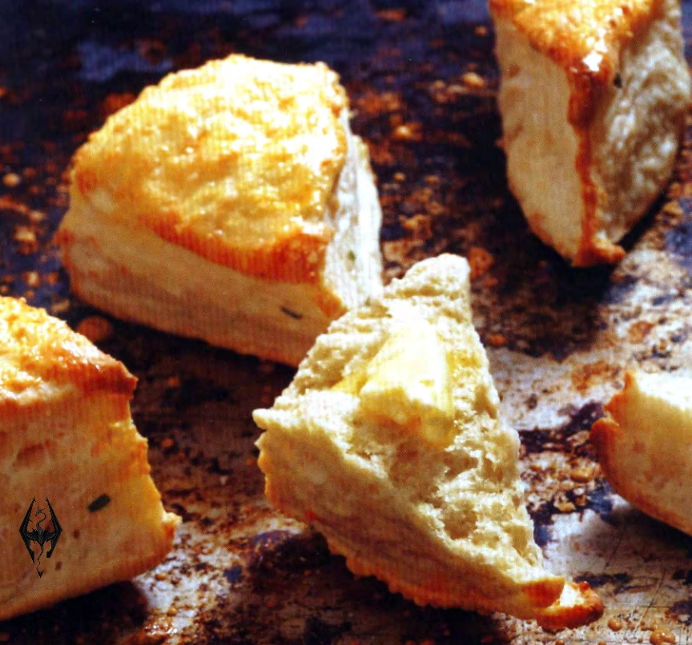

# Cheese scones

{{hi:Asiago}}
{{hi:Cheddar}}
{{hi:Parmigiano Reggiano}}

## Ingredienti

| Ingredienti                  | Ingredienti             |
| ---------------------------- | ----------------------- |
| **272 g** - All-purpose flour | **\\( \frac{1}{2} \\) cup** - Sour cream |
| **2 tablespoons** - sugar | **80 g** - Aged shredded cheese (Asiago) |
| **2 teaspoons** - Baking powder | **\\( \frac{3}{4} \\) cup** - Buttermilk |
| **\\( \frac{1}{2} \\) teaspoon** - Mustard powder | **1** - Egg, lightly beaten |
| **\\( \frac{1}{2} \\) teaspoon** - Salt | **2 tablespoons** - Grated parmigiano |
| **50 g** - Cold butter, cubed | **** - |

## Procedimento

> Preheat the oven to 200°

1. In a large bowl, combine the flour, sugar, baking powder, mustard powder, and salt. Rub in the butter with your fingers until you have a fine, crumbly texture.
1. Add the sour cream, stirring until it has been evenly distributed. Mix in the cheese, then add a little buttermilk at a time until you get a good dough with a consistency that isn't too dry or too wet.
1. Lightly flour a work surface and turn out the dough. Press the dough flat and fold it over onto itself a few times to give the scones some layers, then press out to about \nicefrac{1}{2} inch thick in a roughly circular shape. Using a sharp knife, slice the dough into irregular triangles and place them on a baking sheet that has been greased with butter or lined with parchment.
1. Brush the scones with beaten egg and sprinkle with Parmesan cheese, then bake for 15 minutes, or until golden and baked through.
