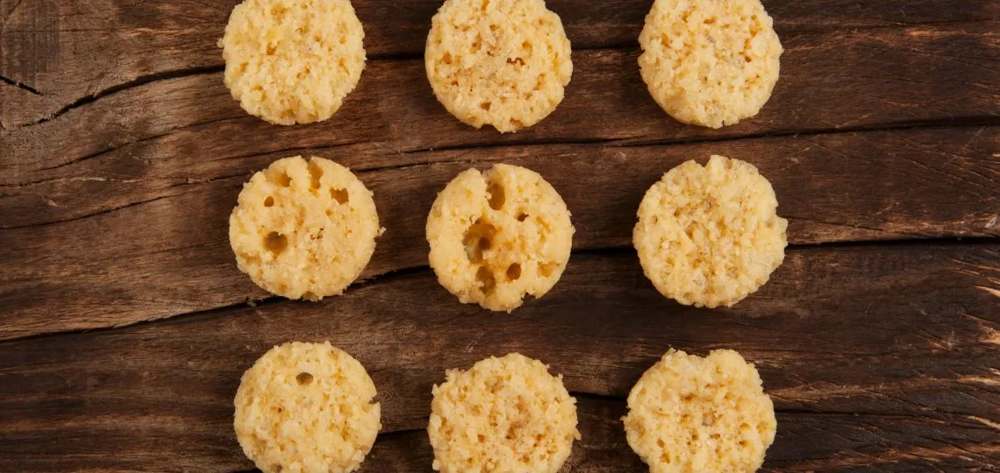

# Chips di parmigiano

## Ingredienti

| Ingredienti                        | Ingredienti                     |
| ---------------------------------- | ------------------------------- |
| \| 30 g \| Parmigiano grattugiato  | 1 cucchiaio semi di lino interi |
| \| $1/2$ cucchiaio \| semi di chia | 1 cucchiaio semi di zucca       |
## Procedimento

> Preriscaldare il forno a 180°

1. Fodera una teglia con un foglio di carta da forno.
2. Mescola il formaggio e i semi misti in una ciotola.
3. Distribuisci delle piccole porzioni di impasto sulla teglia, lasciando un po' di spazio tra di loro. Non appiattire le porzioni.
4. Cuoci in forno per circa 8/10 minuti e controllare spesso. Le chips dovrebbero diventare di colore marrone chiaro, e non scurirsi troppo.
5. Togli le chips di parmigiano dal forno e lasciale raffreddare prima di servirle.

