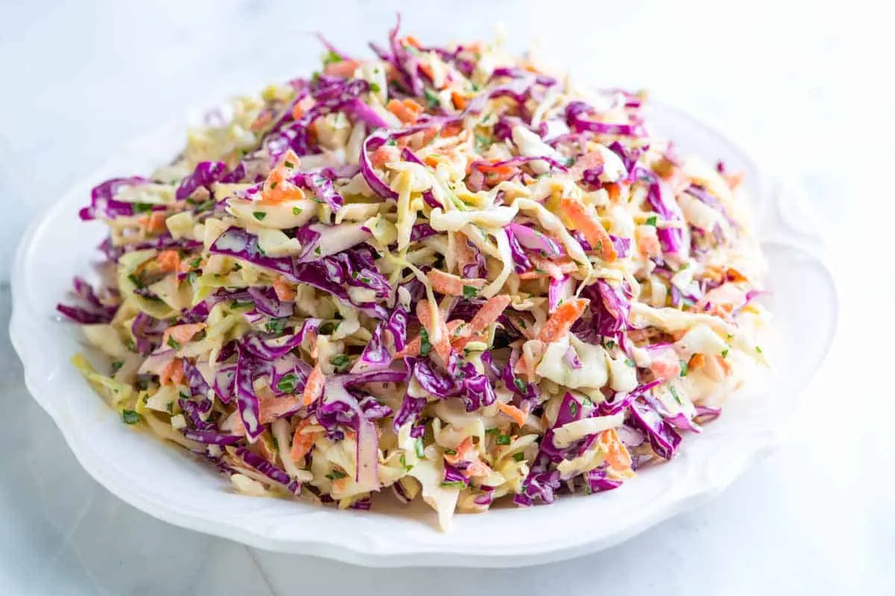

# Coleslaw

{{hi:Cappuccio}}
{{hi:Carote}}
{{hi:mayonese}}

## Ingredienti

| Ingredienti                  | Ingredienti             |
| ---------------------------- | ----------------------- |
| **1** - Cappuccio di vario colore | **2 tbsp** - Aceto |
| **3** - Carote | Aneto |
| **170 g** - Mayonese | **1 tbsp** - Prezzemolo |
| **2 tbsp** - Senape | Sale e pepe |

## Procedimento

1. Si puliscono e preparano i cappucci: Si eliminano le foglie esterne, rovinate o secche. Si taglia il cappuccio in quarti, si eliminano i cuori e si tagliano a striscioline sottili
1. Si puliscono e grattugiano le carote
1. Si mescolano Mayonese, senape, aceto e spezie in una ciotola.
1. Si versa poco alla volta la salsa sulle verdure mescolando bene.
