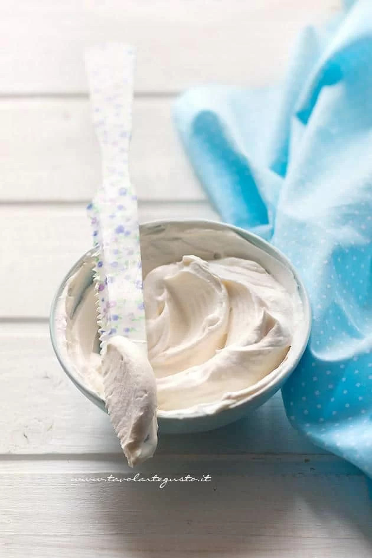

# Crema al latte

{{hi:Latte condensato}}

## Ingredienti

| Ingredienti                  | Ingredienti             |
| ---------------------------- | ----------------------- |
| **200 g** - Panna da cucina da montare già zuccherata | **1 cucchiaio** - Miele |
| **60 g** - Latte condensato | |

## Procedimento

1. Prima di tutto, montate la panna a neve fermissima.
1. Aggiungete il latte condensato e il miele.
1. Mescolate delicatamente con una spatola, la vostra crema al latte dal basso verso l'alto per evitare di smontare il composto 2 minuti esatti, il tempo che tutti gli ingredienti si amalgamino tra loro.

## Scelta della panna

La scelta della panna incide sul risultato della crema. Dunque fate attenzione alla tipologia che scegliete! 

Di solito utilizzo e consiglio la panna da montare Hoplà già zuccherata che si vende in confezioni di cartoncino. La confezione è a lunga conservazione, quindi non la trovate nel banco frigo, ma solitamente nei pressi delle panne per condire i tortellini. Prima di essere montata con le fruste elettriche va tenuta in frigo qualche ora! 

In alternativa, potete utilizzare le buste Dolceneve Cameo. Si tratta di panna in polvere che va poi montata insieme ad un quantitativo specifico di latte fresco, indicato dietro la busta. Il mio consiglio in questo caso è di aggiungere sempre 20 gr in meno di latte rispetto alle dosi indicate, per avere una panna montata bella densa. 

Sconsiglio vivamente di acquistare la panna liquida fresca nel banco frigo. Nonostate sia decisamente buona, purtroppo quando andate a montarla (con almeno 3 cucchiai di zucchero a velo) non risulta densa e corposa e mescolata poi con il latte condensato e il miele, rischiate di ottenere una crema al latte troppo liquida. 

Stessa cosa con la panna spray. Assolutamente da evitare! Perchè si liquefa immediatamente!
