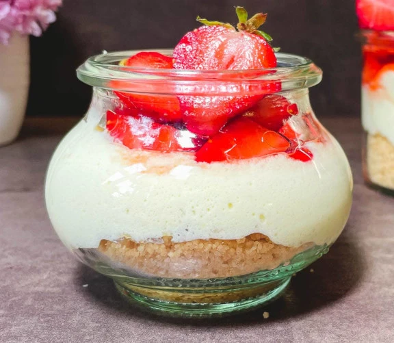

# Crema al mascarpone con crumble e fragole

{{hi:Mascarpone}}
{{hi:Fragole}}

## Ingredienti

| Ingredienti                  | Ingredienti             |
| ---------------------------- | ----------------------- |
| **250 g** - Mascarpone | **75 g** - Farina 00 |
| **2** - Uova | **125 g** - Fragole |
| **100 g** - Zucchero | **1** - Limone |
| **30 g** - Burro |  |

## Procedimento

### Crumble

> Preriscaldare il forno a 170°

1. Inserire 30 g di burro freddo a piccoli cubetti, 50 g di zucchero, 75 g di farina e un bel pizzico di sale in una ciotola. Lavorare con la punta delle dita finché si ottengono delle briciole fini.
1. Cuocere a 170° per circa 30 minuti o finché il crumble sarà uniformemente dorato. Estrarre dal forno e mescolare con un cucchiaio. Lasciare raffreddare.
1. Attenzione: durante la cottura è importante tenere d'occhio il crumble e mescolare di tanto in tanto.
1. Tagliare le fragole a cubetti, metterle in una ciotola e condirle con due cucchiai di zucchero (o più a seconda dei vostri gusti) e il succo di mezzo limone. Mettere da parte.

### Crema al mascarpone

1. Dividere gli albumi dai tuorli e inserirli in due ciotole separate.
1. Aggiungere 2 cucchiai di zucchero e la scorza di mezzo limone ai tuorli e montarli finche saranno chiari e spumosi.
1. Aggiungere il mascarpone metà per volta e continuare a montare finché si sarà amalgamato.
1. Lavare le fruste e asciugarle per bene. Montare gli albumi a neve ferma con un cucchiaio di zucchero e un cucchiaino di succo di limone. Riporre in frigorifero.
1. Con l'aiuto di una spatola amalgamare delicatamente gli albumi al composto di tuorli e mascarpone. Procedere delicatamente facendo attenzione a non smontare la crema.
1. Riporre immediatamente la crema in frigorifero per almeno 3 ore.

### Composizione

1. Mettere un paio di cucchiai di crumble alla base di ogni vasetto (o bicchiere), continuare con la crema e terminare con le fragole e il loro succo.
