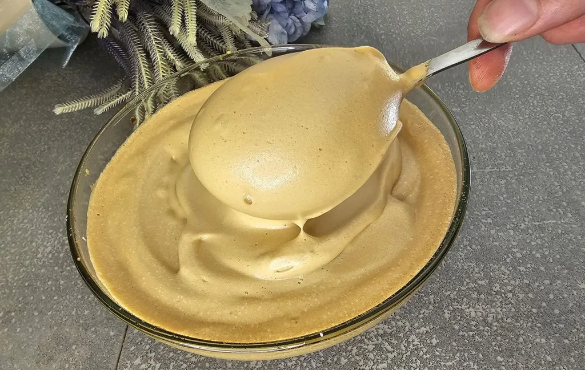

# Crema caffè

{{hi:Caffè solubile}}

## Ingredienti

| Ingredienti                  | Ingredienti             |
| ---------------------------- | ----------------------- |
| **10 g** - Caffè solubile | **70 g** - Dolcificante maltitolo (o zucchero) |
| **70 g** - Acqua ghiacciata (da freezer) | |

## Procedimento

1. Per iniziare inserite il caffè solubile in una scodella capiente, aggiungete il dolcificante (oppure lo zucchero), mescolate e infine aggiungete l’acqua ghiacciata.
2. Adesso sbattete adeguatamente con le fruste elettriche per circa 5-10 minuti, così da ottenere un composto dalla consistenza liscia, corposa e bella cremosa
3. Infine, una volta ottenuta la crema caffé aiutandovi con un cucchiaio, trasferitela nei bicchieri di vetro da dessert, dopodiché non vi resta altro che gustarvela. 
4. Potete aggiungere se siete golosi delle scaglie di cioccolato o spolverare con un po’ di cacao in polvere. Si consiglia di consumarla al momento!

## Note

Potete usare anche un altro tipo di dolcificante come l’eritritolo o la stevia, ma la consistenza della crema caffé non sarà la stessa (sarà più spumosa). Quindi consiglio l’uso del maltitolo che potete trovare in vendita su amazon (l’unico dolcificante naturale che si comporta come lo zucchero nei dolci).

