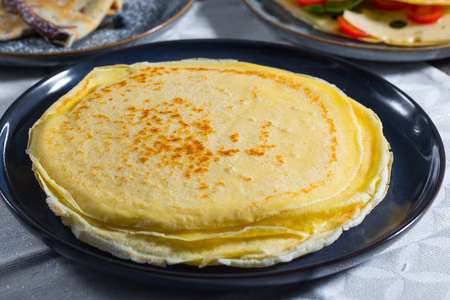

# Crepe dolci e salate

{{hi:Pomodoro}}

## Ingredienti

| Ingredienti                  | Ingredienti             |
| ---------------------------- | ----------------------- |
| **3** - Uova | **500 g** - Latte intero |
| **250 g** - Farina 00 | **40 g** - Burro |

## Procedimento

1. Per preparare le crepe dolci e salate iniziate sciogliendo dolcemente il burro in un pentolino; lasciatelo intiepidire. 
1. Nel frattempo rompete le uova in una ciotola dai bordi alti. Mescolate con una frusta e unite il latte. Continuate a mescolare sino ad ottenere un composto omogeneo. 
1. Aggiungete ora il burro tiepido e mescolate ancora. 
1. Posizionate un colino sul recipiente e poi setacciate la farina nella ciotola (per comodità potete anche aggiungerla in due tempi e mescolare così da evitare la formazione di grumi). 
1. Con le fruste mescolate energicamente per assorbire la farina. 
1. Continuate a mescolare fino ad ottenere un composto omogeneo, vellutato e privo di grumi. 
1. A questo punto coprite la ciotola con della pellicola alimentare e lasciate riposare per almeno 30 minuti in frigorifero. 
1. Trascorso il tempo mescolate l'impasto per farlo rinvenire e poi scaldate una crepiera da 18 cm (o in alternativa una padella antiaderente sempre della stessa base) ed ungetela con una noce di burro. 
1. Una volta a temperatura versate un mestolo di impasto sufficiente a ricoprire la superficie della padella: potete aiutarvi con l'apposito stendi pastella per crepe oppure ruotare la padella fino a distribuire il composto uniformemente (fate attenzione a non spanderlo tutto sui bordi per evitare che al centro non rimanga pastella sufficiente a creare una crepe dalla superficie uniforme); si consiglia di eseguire queste operazioni molto in fretta, poiché la pastella cuocerà rapidamente.
1. Trascorso circa 1 minuto a fuoco medio-basso, dovreste notare una leggera doratura, i bordi tenderanno a staccarsi perciò potrete girare la prima crepe aiutandovi con una paletta. 
1. Cuocete anche l'altro lato per 1 minuto circa, aspettando che prenda colore. 
1. Una volta cotta la prima, trasferitela su un piatto da portata o su di un tagliere.
1. Ripetete questa operazione fino a finire l'impasto, ungendo di volta in volta la crepiera, dovreste ottenere così 14 crepe del diametro di 18 cm: impilate ogni crepe una sopra l'altra così resteranno morbide.
