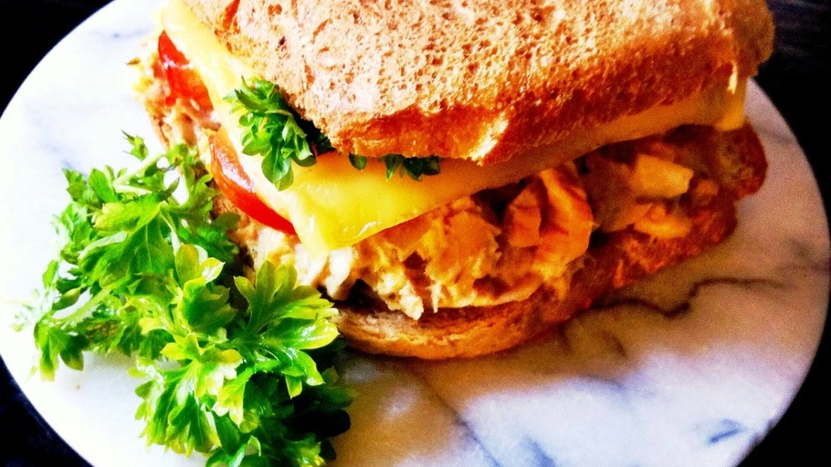

# Crispy tuna melt

{{hi:Tonno}}
{{hi:Capperi}}
{{hi:Asiago}}
{{hi:Peperone}}

## Ingredienti

| Ingredienti                  | Ingredienti             |
| ---------------------------- | ----------------------- |
| **2 slices** - Whole wheat bread or ciabatta | **1** - African chilles, sliced |
| **1 can** - Tuna, drained | **1** - Scallion, finely chopped |
| Djon mustard | **1** - Small onion, finely chopped |
| **2 tbsp** - Mayonnaise | **1 clove** - Garlic, finely chopped |
| **1 tbsp** - Cappers, finely chopped | **1 tbsp** - Balsamic vinegar |
| **1** - Dill pickle, finely chopped | **1tsp** - Basil |
| **1** - Small preserved onion, finely chopped | Salt & pepper |
| **1** - Tomato, sliced | **1 tbsp** - Lemon juice |
| **1 slice** - Cheddar cheese |  |

## Procedimento

> Preheat the oven to 180°

1. Put mayonnaise in a small bowl. Mix in pickle, preserved onion, cappers, onion, garlic, scallion, lemon juice, basil, fresh parsley, balsamic vinegar salt and black pepper. Drain the tuna and mix it into the mixture (add 1 chopped hard-boiled egg if you want to)
1. Smear some Dijon mustard on one slice of bread and place some tuna mixture. Place slices of tomatoes, chili (save 2-3 slices) and end with a slice of cheese. Place it in the oven for about 5 mins.
1. Toast the other slice of bread in a toaster. Smear some Dijon mustard on the slice.
1. Take out the bread from the oven. Sprinkle some fresh parsley on the melted cheese and the rest of the chili slices. Place the toasted slice on top.
