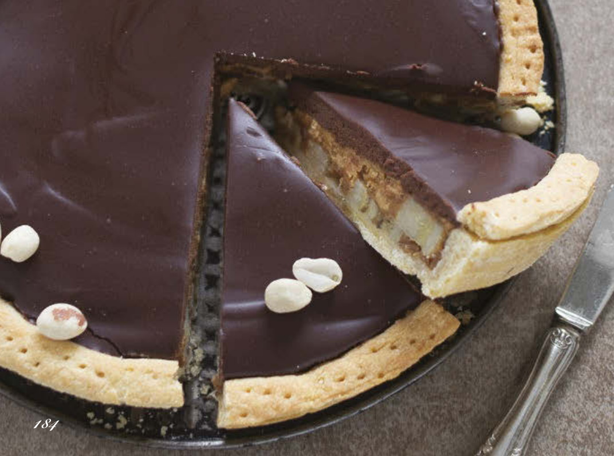
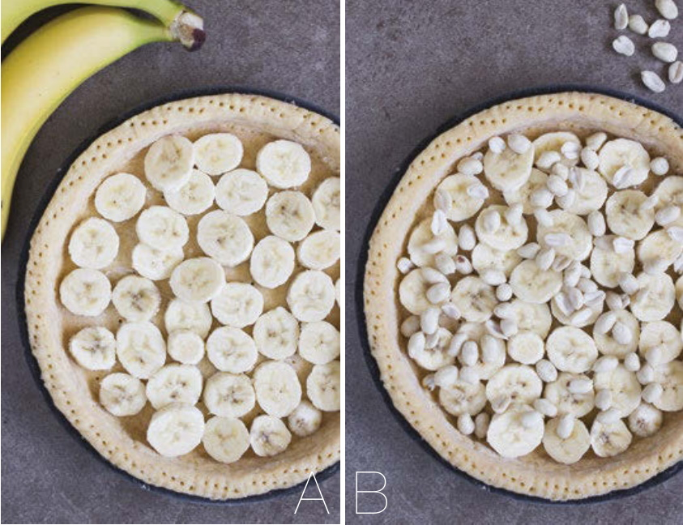
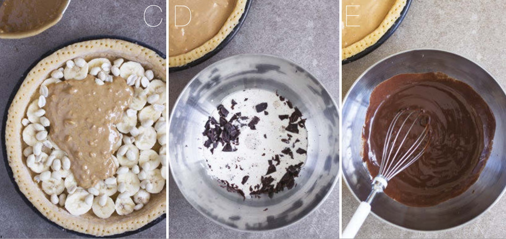

# Crostata al cioccolato banana e arachidi

{{hi:Burro di arachidi}}

## Ingredienti

**Farcitura**

| Ingredienti                  | Ingredienti             |
| ---------------------------- | ----------------------- |
| **2** - Banane| **200 g** - Cioccolato fondente |
| **250 g** - Burro di arachidi | **200 g** - Panna fresca |
| **70 g** - Arachidi già sgusciate | |

**Per la frolla**

| Ingredienti                  | Ingredienti             |
| ---------------------------- | ----------------------- |
| **300 g** - Farina | **2** - Uova |
| **130 g** - Zucchero | Burro |
| **60 g** - Zucchero | Farina |

## Procedimento

### Frolla

1. Miscelate la farina con lo zucchero, aggiungete il burro freddissimo, tagliato a cubetti
2. Lavorate velocemente il tutto finché non avrete ottenuto un composto bricioloso. 
3. Incorporate le uova e proseguite a impastare fino ad avere un panetto liscio e omogeneo. 
4. Avvolgetelo con un foglio di pellicola trasparente e lasciate riposare in frigorifero per mezz'ora.
5. Imburrate e infarinate una tortiera da 22 cm di diametro. 
6. Stendete la frolla, ricavate un disco spesso circa 1,5 cm e foderatevi lo stampo. Bucherellate il fondo e il bordo con i rebbi di una forchetta. 
7. Sbucciate le banane, tagliatele a rondelle e sistematele sul fondo (**foto A**). Cospargete con le arachidi (**foto B**).

### Ripieno

> Preriscaldare il forno a 180°C

1. Scaldate leggermente il burro di arachidi, per renderlo più fluido, e cospargetelo in superficie (**foto C**). 
2. Infornate a 180 °C e fate cuocere per circa 20 minuti, quindi sfornate e lasciate raffreddare completamente.
3. Riducete a pezzetti il cioccolato fondente e raccoglietelo in una ciotola; versate sopra la panna calda (**foto D**), 
4. lasciate riposare per un paio di minuti e poi emulsionate con una frusta (**foto E**).
5. Versate il cioccolato tiepido sulla crostata, trasferite in frigorifero e lasciate rassodare per almeno 4-6 ore. 
6. Tagliate a fette e servite.

