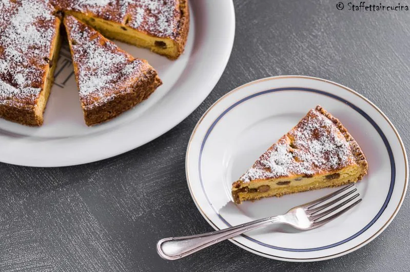

# Crostata di ricotta

{{hi:Ricotta}}

## Ingredienti

**Per la pasta frolla**

| Ingredienti                  | Ingredienti             |
| ---------------------------- | ----------------------- |
| **125 g** - Burro | Scorza gratugiata di limone |
| **90 g** - Zucchero | **1 pizzico** - Sale |
| **250 g** - Farina 00 | **\\(\frac{1}{2}\\) bustina** - Vanilina |
| **2** - Tuorli | |

**Per il ripieno**

| Ingredienti                  | Ingredienti             |
| ---------------------------- | ----------------------- |
| **400 g** - Ricotta | Uva sultanina |
| **2** - Uova | **2-3 cucchiai** - Rum |
| **4-5 cucchiai** - Zucchero | Grappa |

## Procedimento

> Preriscaldare il forno a 180°

1. Sulla spianatoia disponete lo zucchero a fontana, aggiungete il burro morbido tagliato a pezzi, i tuorli, la farina, la scorza del limone, il sale e la vanillina.
2. Lavorate poco l’impasto perché non si riscaldi troppo.
3. Fate una palla e avvolgetela nella pellicola.
4. Fate riposare in frigo qualche ora, meglio una notte.
5. Mettere a mollo l'uva sultanina nella grappa.
6. Montare a neve i bianchi delle uova.
7. Mescolate la ricotta con i 2 tuorli e lo zucchero, poi aggiungete l’uva sultanina, il Rum e infine i bianchi montati a neve.
8. Con il mattarello stendete la frolla.
9. Imburrate e infarinate una tortiera. Fate aderire bene la frolla allo stampo, tagliate con un coltellino la pasta in eccesso che fuoriesce dai bordi e versate il composto.
10. Cuocete in forno statico a 180°C per 60 minuti.
