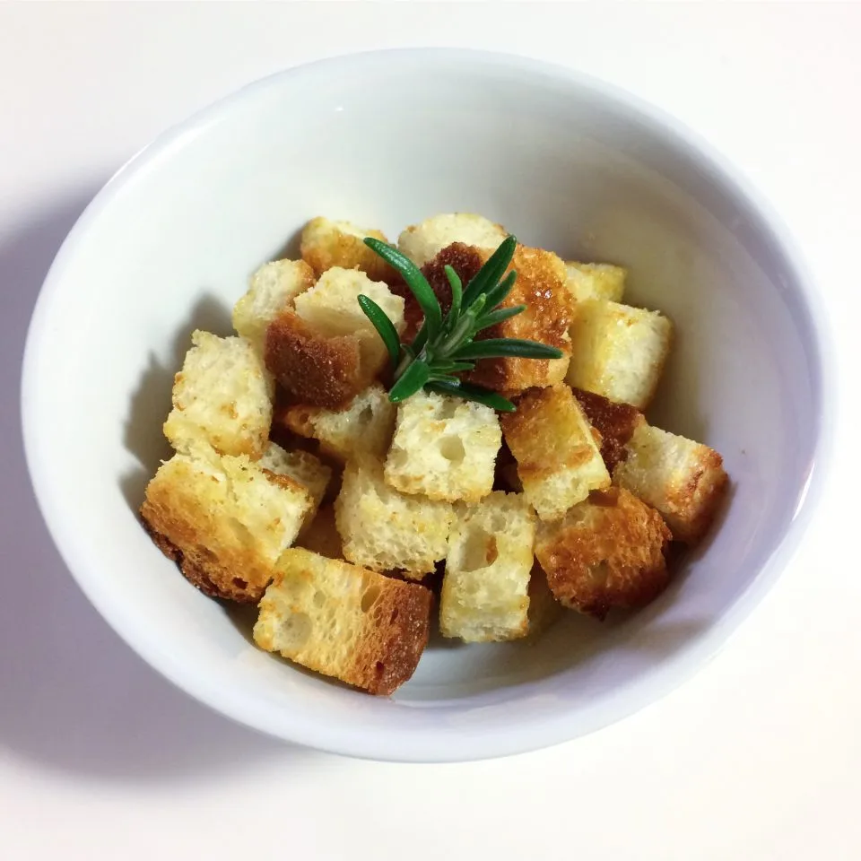

# Crostini di pane fritti

## Ingredienti

| Ingredienti                  | Ingredienti             |
| ---------------------------- | ----------------------- |
| **2 fette** - Pane | **1 rametto** - Rosmarino |
| **1 filo** - Olio evo | **1 pizzico** - Sale |
| **1 spicchio** - Aglio | **1 pizzico** - pepe |

## Procedimento

1. Per prima cosa bisogna tagliare il pane a fette, quindi a cubetti di circa 1cm di lato. Utilizzate un pane abbastanza compatto ed un coltello liscio, con quello seghettato da pane fareste troppe briciole che poi in cottura si bruciano. Se volete potete eliminare la crosta, a me ad esempio piacciono le diverse consistenze quindi la lascio.
2. In una padellina antiaderente fate scaldare un filo di olio extravergine d’oliva, assieme ad un rametto di rosmarino e uno spicchio di aglio in camicia. 
3. Quando l’olio è ben caldo, mettete i crostini in padella avendo cura di non farci cadere troppe briciole che altrimenti bruceranno.
4. Salate, pepate, quindi friggete i cubetti di pane, rigirandoli molto spesso con un cucchiaio di legno, per alcuni minuti fino a quando avranno assunto un bel colore dorato.
5. Se dovesse rimanere troppo olio in padella, asciugateli con della carta da cucina. Io vi consiglio di non esagerare con l’olio perchè i crostini troppo unti risultano poi pesanti.
6. Servite infine i vostri crostini ancora caldi e rendete speciali i vostri piatti.