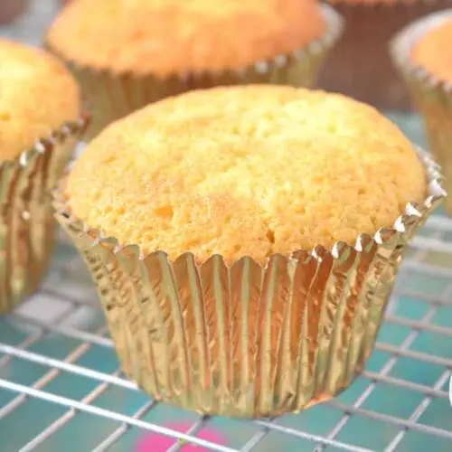

# Cupcake

## Ingredienti

**Cupcake**

| Ingredienti                  | Ingredienti             |
| ---------------------------- | ----------------------- |
| **120 g** - Burro a temperatura ambiente | Essenza di vaniglia |
| **120 g** - Farina 00 | **~ 25 g** - Lievito in polvere per dolci |
| **120 g** - Zucchero | **1 pizzico** - Sale |
| **3** - Uova | |

**Glassa**

| Ingredienti                  | Ingredienti             |
| ---------------------------- | ----------------------- |
| **300 g** - Zucchero a velo | **1 cucchiaino** - Essenza di vaniglia |
| **150 g** - Burro a temperatura ambiente | **1 cucchiaio** - Latte intero |

## Procedimento

> Preriscaldare il forno a 180°

1. Per preparare i cupcake cominciate a portare a temperatura ambiente burro e uova. 
1. Versate quindi il burro ammorbidito in una ciotola, aggiungete lo zucchero 1 e l'essenza di vaniglia (in alternativa usate scorza di limone). Azionate le fruste a velocità medio alta e lasciate che il composto monti leggermente.
1. Dopo qualche minuto unite le uova un po' alla volta, continuando a lavorare con le fruste. 
1. Non appena queste saranno incorporate, spegnete le fruste e sistemate un colino sulla ciotola.
1. In questo modo potrete setacciare la farina e il lievito per dolci. Mescolate bene con una spatola ed ecco pronto l'impasto.
1. Riempite 12 pirottini di carta disposti in una leccarda da muffin. Sarà sufficiente riempire a cucchiaiate ogni stampino con circa 40 g di impasto. 
1. Prima di infornare sbattete più volte la teglia sul piano da lavoro, in questo modo andrete a livellare accuratamente la superficie e otterrete dei cupcake gonfi ma con la superficie piatta. 
1. Cuocete in forno caldo a 180° per circa 25 minuti. Una volta cotti lasciateli raffreddare a temperatura ambiente prima di guarnirli.
1. Per guarnire noi abbiamo scelto un frosting americano caratteristico: si prepara in una ciotola mescolando con le fruste a velocità media il burro a temperatura ambiente insieme a metà dose di zucchero a velo, al latte a temperatura ambiente e l'essenza di vaniglia.
1. Azionate le fruste e lavorate il tempo necessario affinché gli ingredienti si compattino tra loro. Quindi man mano aggiungete lo zucchero a velo che avete da parte, un cucchiaio alla volta. Alla fine avrete ottenuto una crema dalla consistenza liscia e cremosa. Trasferitela in una sac-à-poche con bocchetta a stella e guarnite le tortine
