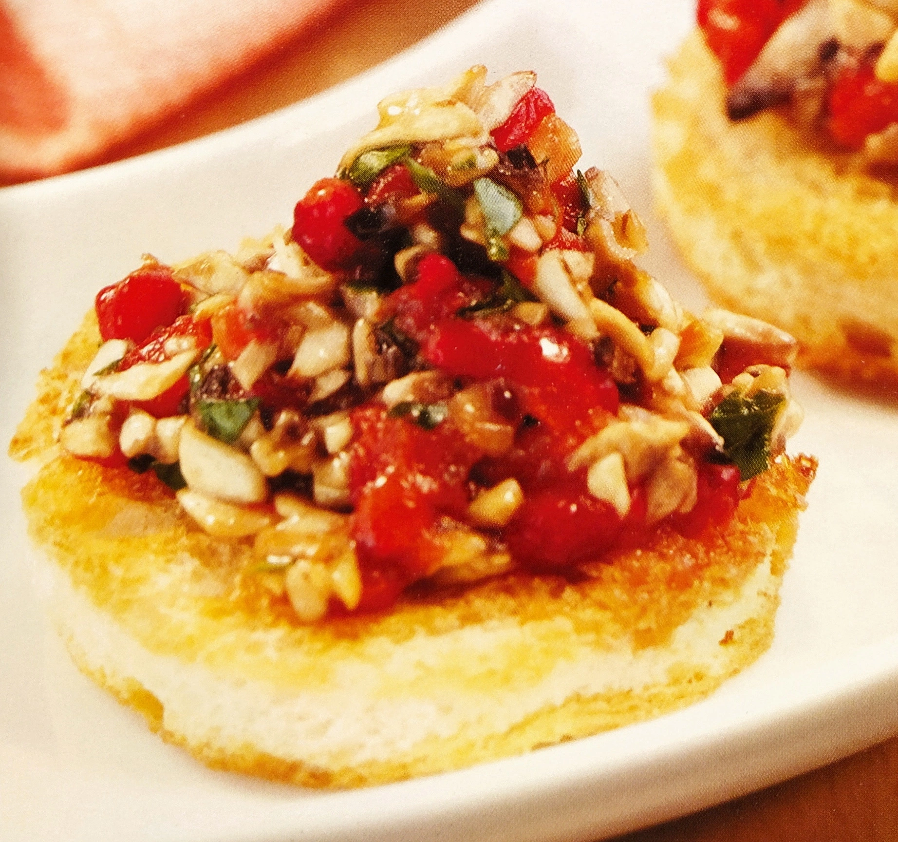

# Disco di champignon e peperone dolce

{{hi:Funghi}}
{{hi:Peperoni}}

## Ingredienti

| Ingredienti                  | Ingredienti             |
| ---------------------------- | ----------------------- |
| **8 fette** - Pane di grano duro in cassetta | **\\( \frac{1}{2} \\)** - Limone |
| **3** - Champignon grandi | Prezzemolo |
| **1** - Peperone rosso | Sale e pepe |
| **2 cucchiai** - Olio evo |  |

## Procedimento

1. Tagliate in 2 parti il peperone e cuocetelo sotto il grill del forno per farlo abbrustolire bene; ponetelo a raffreddare in una busta di nylon per poi pelarlo.
1. Pelate anche gli champignon e tagliateli finemente al coltello; conditeli con il succo di limone, l'olio d'oliva extra vergine e un pizzico di sale.
1. Spellate il peperone e tagliate la polpa a dadini piccolissimi. Tritate il prezzemolo e riunite il tutto ai funghi amalgamando bene, quindi pepate. 
1. Ricavate dalle fette di pane dei dischi e tostateli in forno fino a renderli dorati in superficie. Conditeli con il composto di funghi e peperoni e servite.
