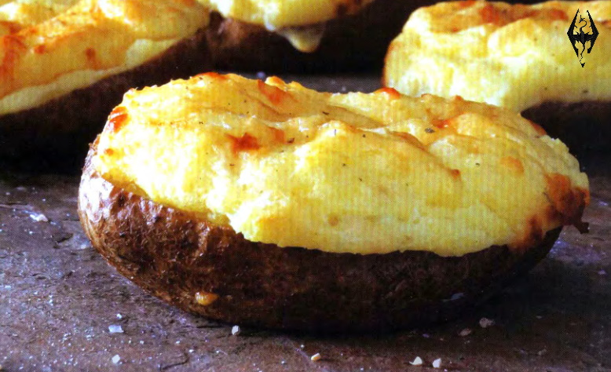

# Double-baked potatoes

{{hi:Patate}}
{{hi:Asiago}}

## Ingredienti

| Ingredienti                  | Ingredienti             |
| ---------------------------- | ----------------------- |
| **2** - Baking potatoes | **\\( \frac{1}{4} \\) cup** - Shredded cheddar cheese |
| **5 tbsp** - Salted butter | Pinch of salt |
| **\\( \frac{1}{4} \\) cup** - Whole milk or heavy cream | |

## Procedimento

1. Preheat the oven to 200°. Clean and dry the potatoes, then pierce several times to allow steam to escape, and lightly coat with 1 tablespoon of the butter for a crispier skin. 
1. Place directly on an oven rack in the middle position with a baking sheet on the rack below to catch any drippings and bake for about 1 hour, or until they are soft all the way through when poked with a knife.
1. When the potatoes are done, cut each in half lengthwise and gently scoop the insides into a bowl, leaving the skins intact. Add the remaining 4 tablespoons of butter and the milk or cream, cheddar cheese, and salt, mashing as you would for mashed potatoes. Scoop this filling back into the potato skins.
1. Turn the oven down to 190° and arrange the filled potato halves on a baking sheet. Put the potatoes back in the oven and cook for about 15 minutes, or until they have started to brown on top. If you'd like a more dramatic color, put the tray of potatoes under the broiler for a minute or so, just to brown the tops a bit more.
1. This is a very simple recipe with good results, but for an extra treat, mix in some crumbled bacon with the filling before you put it back into the skins. Some seasoning can also give a nice boost of flavor.
