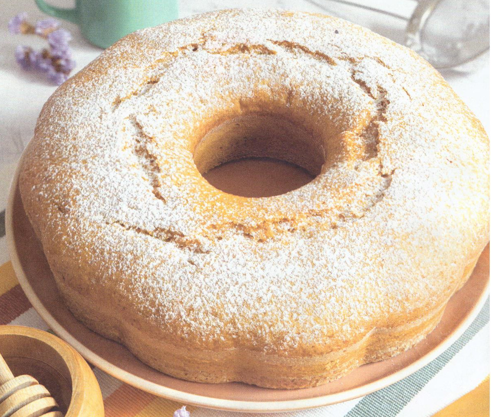

# Fior di ciambella al miele

{{hi:Miele}}

## Ingredienti

| Ingredienti                  | Ingredienti             |
| ---------------------------- | ----------------------- |
| **50 g** - Burro | **1 bustina** - Lievito |
| **100 g** - Latte | **1** - Uovo |
| **200 g** - Miele | **1** - Limone con buccia edibile |
| **250 g** - Farina 00 | **1 pizzico** - Sale |
| **20 g** - Zucchero |  |

## Procedimento

> Preriscaldare il forno a 180°

1. In un pentolino sciogliere 1l burro nel latte a fiamma molto bassa, senza portare a ebollizione. 
1. Aggiungere il miele di acacia e mescolare per farlo sciogliere. 
1. Continuare ad amalgamare per un minuto, sempre senza far bollire, poi spegnere e lasciar intiepidire. 
1. Nel frattempo in una ciotola aggiungere la farina setacciata con il lievito, lo zucchero, un pizzico di sale e la buccia grattugiata di limone. 
1. Rompere al centro l'uovo e unire il succo del limone, mescolando con una frusta. 
1. Aggiungere il composto di latte, miele e burro tiepido e continuare a mescolare fino a ottenere un composto cremoso. 
1. Imburrare e infarinare uno stampo a ciambella e cuocere in forno preriscaldato a 180°C statico per circa 35-40 minuti. 
1. Verificare la cottura con uno stecchino, che deve uscire asciutto. 
1. Una volta pronta, far raffreddare la torta e servirla con miele o una spolverata di zucchero a velo.
