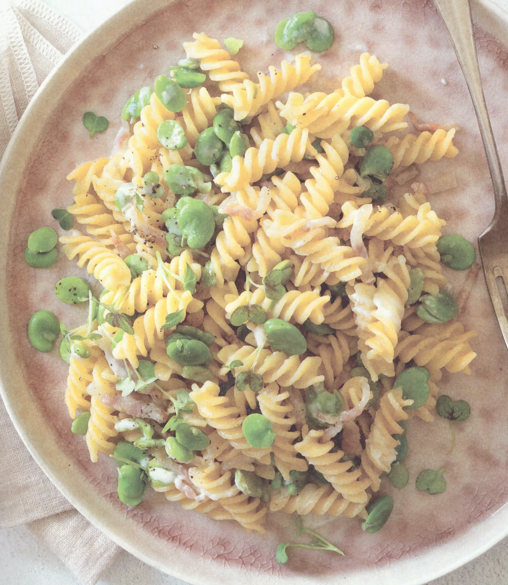

# Fusilli con fave pecorino e guanciale

{{hi:Fave}}
{{hi:Pecorino}}
{{hi:Guanciale}}

## Ingredienti

| Ingredienti                  | Ingredienti             |
| ---------------------------- | ----------------------- |
| **320 g** - Fusilli  | Pecorino romano  |
| **400 g** - Fave fresche pulite | Olio evo |
| **60 g** - Guanciale | Sale |

## Procedimento

1. Cominciare mettendo le fave fresche in un colino e lavandole bene sotto acqua corrente. 
1. Versarle in una pentola con acqua bollente salata e shollentarle per qualche minuto. 
1. Scolarle, eliminare la pellicina esterna e tenerle da parte.
1. Con un coltello togliere la cotenna dal guanciale e tagliarlo a julienne. 
1. Scaldare una capiente padella antiaderente, aggiungere un filo d'olio e il guanciale. 
1. Farlo rosolare per 5-6 minuti a fiamma vivace. 
1. A questo punto aggiungere le fave e proseguire la cottura per 2-3 minuti in modo da farle insaporire. Cuocere in abbondante acqua salata i fusilli, tenendoli al dente. 
1. Scolarli e aggiungerli nella padella con fave e guanciale. Far saltare qualche minuto e mantecare con abbondante Pecorino Romano grattugiato.
