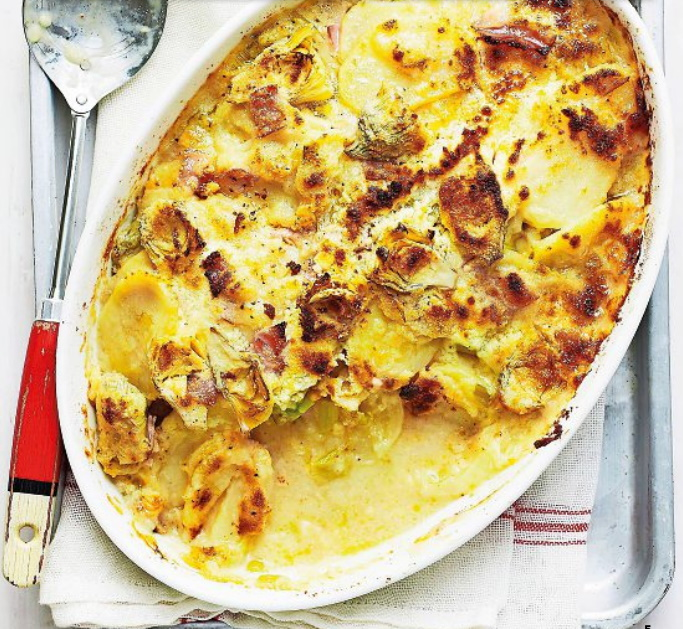

# Gratin con porri e patate

{{hi:Porro}}
{{hi:patate}}
{{hi:Prosciutto}}
{{hi:Parmigiano}}
{{hi:Besciamella}}

## Ingredienti

| Ingredienti                  | Ingredienti             |
| ---------------------------- | ----------------------- |
| **6** - Carciofi puliti | **1** - Limone |
| **4** - Patate farinose | Pangrattato |
| **2** - Porri | Olio evo |
| **80 g** - Prosciutto cotto | Sale |
| **50 g** - Parmigiano | Pepe |
| **250 ml** - Besciamella | |

## Procedimento

> Preriscaldare il forno a 220°

1. Taglia i carciofi a spicchietti mettendoli man mano in acqua acidulata con il succo del limone.
1. Sbuccia le patate e affettale. Elimina la radice dei porri e le foglie più dure, poi tagliali a pezzi.
1. Sgocciola i carciofi, cuocili a vapore con le patate e i porri per 10 minuti, poi lasciali intiepidire e condiscili con sale e pepe. Mescolali con il prosciutto spezzettato e trasferiscili in una pirofila oliata e spolverizzata di pangrattato.
1. Aggiungi la besciamella tiepida, il parmigiano e altro pangrattato, poi cuoci in forno già caldo a 220 °C per 20 minuti accendendo il grill negli ultimi minuti. Fai riposare per 5 minuti e servi.
