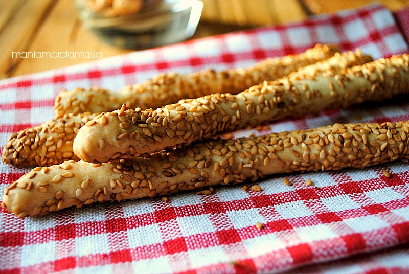

# Grissini con pasta madre avanzata

## Ingredienti

| Ingredienti                  | Ingredienti             |
| ---------------------------- | ----------------------- |
| **100 g** - Lievito madre non rinfescato  | **2 cucchiai** - Olio evo |
| **100 g** - Acqua | **5 g** - Sale (1 cucchiaino) |
| **200 g** - Farina 00 | Semi di sesamo |

## Procedimento

> Preriscaldare il forno a 250°

1. Sciogli il lievito madre avanzato nell'acqua. Unisci la farina e comincia ad amalgamare. Unisci quindi il sale e impasta. Per ultimo aggiungi l'olio.

1. Impasta per qualche minuto fino ad ottenere un impasto liscio e sodo.

1. Copri l'impasto con un telo e fai riposare una mezz'oretta.

1. Stacca dei piccoli pezzi dall'impasto di circa 3/4 cm e forma dei salsicciotti.

1. Partendo dal centro del salsicciotto, con ambedue le mani, allunga il grissino con l'aiuto delle prime tre dita di ogni mano (pollice, indice e medio) ruotandole leggermente in un verso e nell'altro. Non tirare più di quello che l'elasticità dell'impasto ti consente.

1. Man mano sistema i grissini sulla leccarda del forno ricoperta con carta da forno.

1. Prepara il sesamo in un vassoio e inumidiscilo con poca acqua, questo favorirà la presa sui grissini.

1. Quando anche l'ultimo grissino sarà posizionato ricomincia dal primo grissino agendo allo stesso modo di prima per allungarlo ancora un po', vedrai che il riposo avrà reso l'impasto più elastico. Infine rotola i grissini nel sesamo, quindi sistemali sulla teglia.

1. Inforna quindi nel forno caldo a 230 °C in modalità statica fino a doratura per circa 20/25 minuti.

1. Sforna infine i grissini con esubero di lievito madre e lascia raffreddare prima di servire. 
