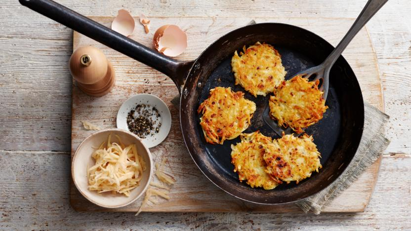

# Hash browns

{{hi:Patate}}
{{hi:Cipolla}}

## Ingredienti

| Ingredienti                  | Ingredienti             |
| ---------------------------- | ----------------------- |
| **4** - Medioum floury potatoes | Salt and pepper |
| **1** - Medium onion | Vegetable oil |
| **1** - Egg, beaten | |

## Procedimento

1. Coarsely grate the potatoes and onion into a clean tea towel and then squeeze out the excess liquid by twisting the towel. Place the mix in a large bowl.
1. Add the egg, a good couple of pinches of salt and freshly ground black pepper (you need to salt the mixture well otherwise the hash browns can be quite bland). Mix the ingredients well.
1. Heat a good glug of oil in a heavy based frying pan and when the oil is hot (but not smoking), add spoonfuls of the potato mixture into the pan and flatten into patties about 1,5 cm thick. Flip over once browned and crispy – about 2–3 minutes each side.
