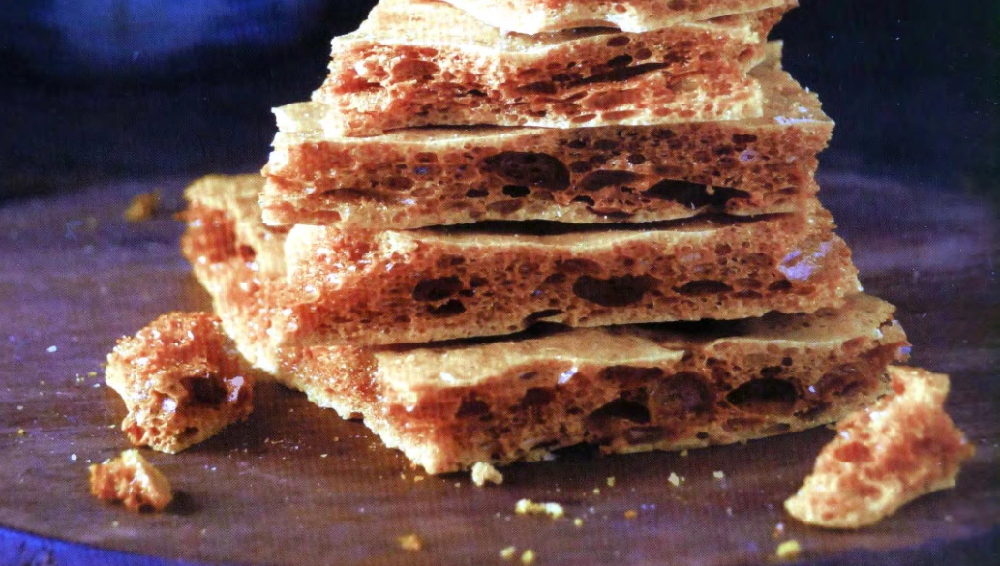

# Honeycomb brittle

{{hi:Miele}}

## Ingredienti

| Ingredienti                  | Ingredienti             |
| ---------------------------- | ----------------------- |
| **1 tblsp** - Salted butter (20 g) | **1 cup** - Honey (340 g) |
| **1 tblsp** - Baking soda (40 g) | **A splash** - Apple cider vinegar |
| **1 cup** - Sugar (200 g) | |

## Procedimento

1. Line a baking sheet with parchment paper and butter the paper, or line it with a silicone pad. Measure out the butter and baking soda and set within easy reach. If you have a candy thermometer, it's recommended that you use it for this recipe. Read through the rest of the instructions, as they involve hot sugar and careful timing.
1. Combine the sugar, honey, water, and apple cider vinegar in a large saucepan with tall sides. Begin heating the mixture over medium-high heat until it reaches 150°.
1. Remove from heat and quickly stir in the butter. Follow this with the baking soda but be careful as you add it, as the baking soda will cause the whole mixture to bubble and expand wildly.
1. Stir thoroughly for about 15 seconds to be sure there are no lumps of soda remaining, then quickly but carefully pour out the mixture onto the prepared baking sheet.
1. Allow the brittle to cool completely on the sheet before breaking it up into pieces to serve.

