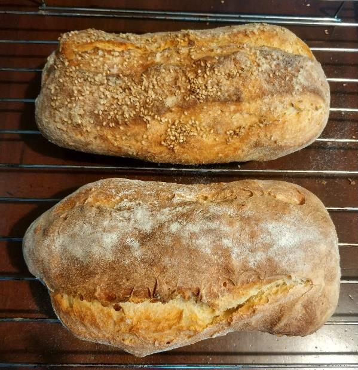

# Impasto pane/pizza con grano duro

## Ingredienti

| Ingredienti                  | Ingredienti             |
| ---------------------------- | ----------------------- |
| **350 ml** - Acqua | **13 g** - Sale |
| **2 g** - Lievito di birra fresco | **13 g** - Olio evo |
| **Per il pane:** | |
| **400 g** - Farina rimacinata di grano duro | **100 g** - Farina manitoba |
| **Per la pizza:** |  |
| **250 g** - Farina 00 | **250 g** - Farina rimacinata di grano duro |

## Procedimento

> Preriscaldare il forno a 220°

1. Sciogliere il lievito nell'acqua a temperatura ambiente
1. Aggiungere man mano la farina, con la frusta mescolare fin quando si otterrà un impasto liquido.
1. Quando inizia ad attaccarsi l'impasto alla frusta, pulire dai residui la stessa e aggiungere il sale e continuare a mescolare con spatola/paletta in
        legno, poi aggiungere altra farina e prima che finisca aggiungere l'olio
1. Dopo 10 minuti si ottiene un impasto non appiccicoso ma nemmeno lucido.  Chiudere l'impasto a pallina e lasciare a ripostare per 20-25 minuti.
1. Dopo aver riposato per 25 min lavorare l'impasto per altri 15-20 min e poi mettere in contenitore ermetico alto e chiudere in frigo per tutta la notte
1. La mattina seguente togliere dal frigo e avvolgere lo stesso contenitore ancora chiuso ermeticamente su un canovaccio e lasciare lievitare altre 6-8 ore (a seconda della temperatura)
1. Quando l'impasto sarà più che raddoppiato togliere dal contenitore e fare le pagnotte/panetti (2 filoni per il Pane, o 4 Panetti per la Pizza) e inciderle, cospargendole di semola.
1. Lasciar riposare per circa 30 minuti coperte.
1. Accendere il forno e preriscaldare a 200-220 gradi
1. Quando il forno raggiunge temperatura impostata, infornare in teglia su carta-forno spolverizzata di semola a metà altezza del forno
1. Cucinare a 220° per 20 minuti e poi a 190° per altri 10

### Con il lievito madre

| Ingredienti                  | Ingredienti             |
| ---------------------------- | ----------------------- |
| **300 ml** - Acqua | **13 g** - Sale |
| **Per il pane:** | |
| **320 g** - Farina rimacinata di grano duro | **80 g** - Farina manitoba |
| **Per la pizza:** |  |
| **200 g** - Farina 00 | **200 g** - Farina rimacinata di grano duro |
