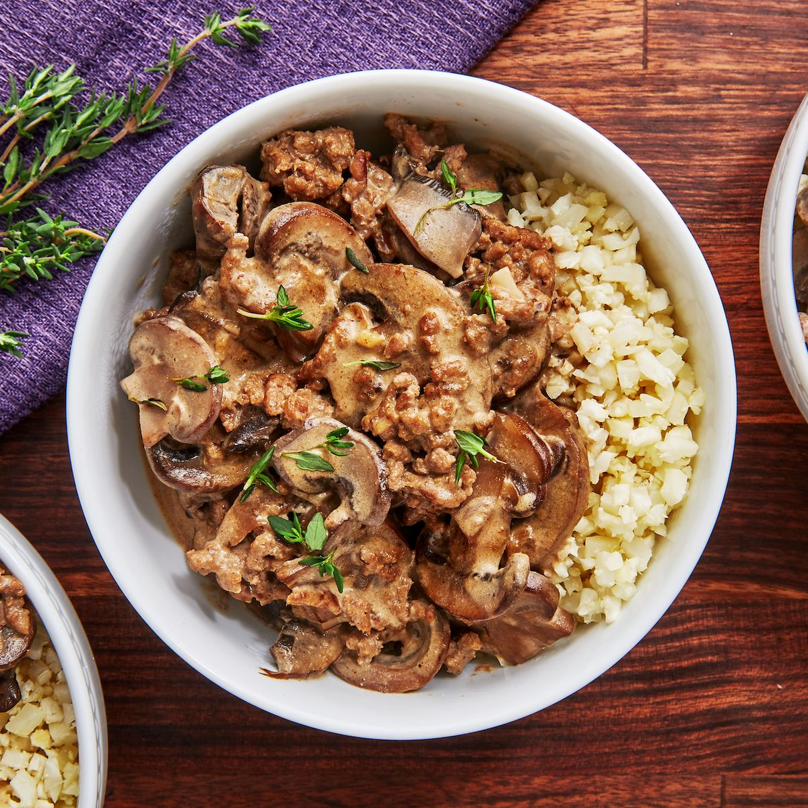

# Keto Beef Stroganoff

## Ingredienti

| Ingredienti                                  | Ingredienti                                    |
| -------------------------------------------- | ---------------------------------------------- |
| **3 tbsp.** butter, divided                  | **4 oz.** cream cheese                         |
| **1 lb.** ground beef                        | **1/2 c.** sour cream                          |
| **q.b.** Kosher salt                         | **2 tsp.** Worcestershire sauce                |
| **q.b.** Freshly ground black pepper         | **2 tsp.** Dijon mustard                       |
| **1,5 lb.** mushrooms, sliced                | **1/2 tsp.** paprika                           |
| **1** garlic clove, minced                   | **q.b.** Finely chopped parsley, for garnish   |
| **1 c.** low-sodium beef stock or bone broth | **q.b.** Steamed cauliflower rice, for serving |

## Procedimento

1. Heat a large skillet over medium-high and melt 1 tablespoon of butter.
2. Add ground beef and season with salt and pepper.
3. Cook beef, stirring occasionally, until cooked through, about 10 minutes.
4. Transfer meat to a plate.
5. Return skillet to medium-high heat and add remaining butter and mushrooms.
6. Cook, tossing occasionally, until mushrooms are golden, about 7 minutes.
7. Season with salt and pepper and add garlic. Cook until fragrant, 1 minute.
8. Add broth, cream cheese, sour cream, Worcestershire, Dijon, and paprika to skillet. Bring to a simmer, stirring.
9. Return beef to skillet and stir to combine.
10. Serve over cauliflower rice with garnish with parsley.

