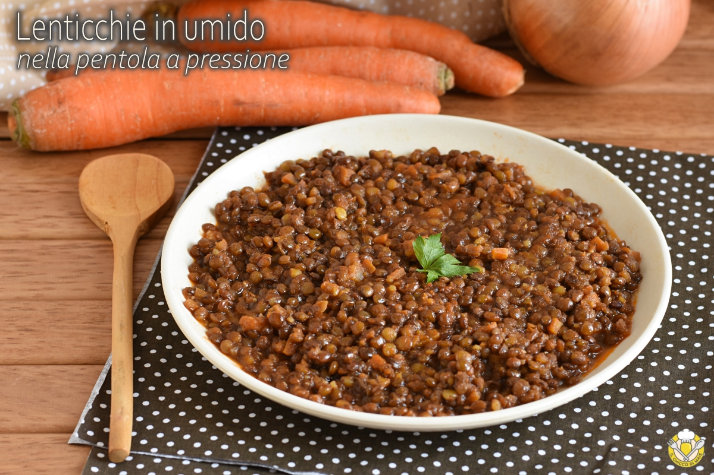

# Lenticchie in umido in pentola a pressione

{{hi:Pomodoro}}

## Ingredienti

| Ingredienti                  | Ingredienti             |
| ---------------------------- | ----------------------- |
| **320 g** - Lenticchie secche | **600 ml** - Brodo vegetale |
| **1/2** - Cipolla | **4 cucchiai** - Olio evo |
| **1** - Carota | Sale |
| **1 costa** - Sedano | Pepe |
| **350 g** - Passata di pomodoro | |

## Procedimento

1. Mettete le lenticchie a bagno in acqua fredda per almeno un’ora, anche di più se avete tempo. 
2. Risciacquatele abbondantemente.
3. Tritate la cipolla e la carota, pulite la costa di sedano e fate soffriggere il tutto nella pentola a pressione aperta con l’olio.
4. Unite quindi la passata di pomodoro, un pizzico di sale, il pepe e lasciate cuocere per 5 minuti sempre con la pentola aperta. 
5. Unite quindi le lenticchie.
6. Salate ancora leggermente e aggiungete l’acqua o il brodo vegetale. Chiudete la pentola a pressione e attendete che la valvola del vapore si alzi.
7. Da quando inizia a fischiare, cuocete le lenticchie in umido nella pentola a pressione per 13-15 minuti.
8. Una volta trascorsi i minuti di cottura, spegnete il fuoco ed aprite la valvola per la fuoriuscita del vapore. Aspettate che sia uscito del tutto e che si abbassi la valvola di sicurezza, quindi aprite la pentola a pressione.
9. Se dovessero risultare eccessivamente acquose, lasciate cuocere le lenticchie in umido nella pentola a pressione senza coperchio per un paio di minuti, giusto il tempo necessario a restringere il sugo.

