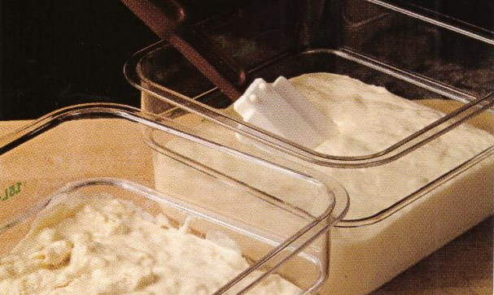

# Lieviti base o lieviti in pasta

I lieviti in pasta, ovvero i preimpasti già fermentati che si aggiungono a quello principale secondo il metodo detto "impasto indiretto", vengono preparati da 24 ore a mezz'ora prima della lavorazione. 
La piccola quantità di lievito che si utilizza per la loro preparazione fa sì che tutto l'impasto si trasformi in lievito, e che l'impasto principale non conservi traccia del sapore dell'originale lievito di birra. Vi sono almeno tre tipi di lievito, differenti per quanto riguarda il tempo di fermentazione a cui vengono sottoposti prima di essere incorporati nell'impasto principale. Tutti e tre fermentano in un luogo controllato, di solito una teglia chiusa da un coperchio, oppure sul tagliere coperti da un'ampia ciotola. Il "lievitino" riposa
appena mezz'ora, tempo comunque sufficiente a farlo aumentare notevolmente di volume. Per la sua produzione si utilizza metà della farina e la si miscela a tutto il lievito previsto dalla ricetta.
Questa proporzione darà vita a una levitazione molto accentuata e veloce. Seguono la "biga" e
la "biga Polish" caratterizzate da tempi di riposo più lunghi.

I vantaggi dell'impasto indiretto sono molti e ripagano del maggiore tempo necessario alla sua
preparazione: con questo metodo si ottiene infatti un pane più saporito, strutturato e di migliore conservabilità e digeribilità. Come già spiegato la cosiddetta "pasta acida”, o "pasta madre" è invece una pasta a lievitazione totalmente naturale (senza aggiunta di lievito commerciale in alcuna fase della lavorazione) di cui deve essere conservata una porzione ogni volta che si fa il pane; sarà infatti questo stesso impasto a fare da innesto nella   successiva. La pasta madre conferisce al pane eccellenti proprietà aromatiche e nutrizionali, ma ha lo svantaggio di necessitare di attenzione e nutrimento costanti per mantenersi efficiente. A meno che non facciate il pane ogni giorno, si tratta di un prodotto difficile da utilizzare. I forni con flussi di lavoro continuo possono invece usarla senza problemi.

I lieviti in pasta possono essere conservati sia a temperatura ambiente sia in frigorifero; ciascuno dei due metodi conferisce proprietà diverse al prodotto finito: le madri conservate al freddo assumono caratteri acidi con aromi simili a quelli dell'aceto; le madri conservate a temperatura ambiente ricordano gli acidi dello yogurt.
