# Linzer Torte

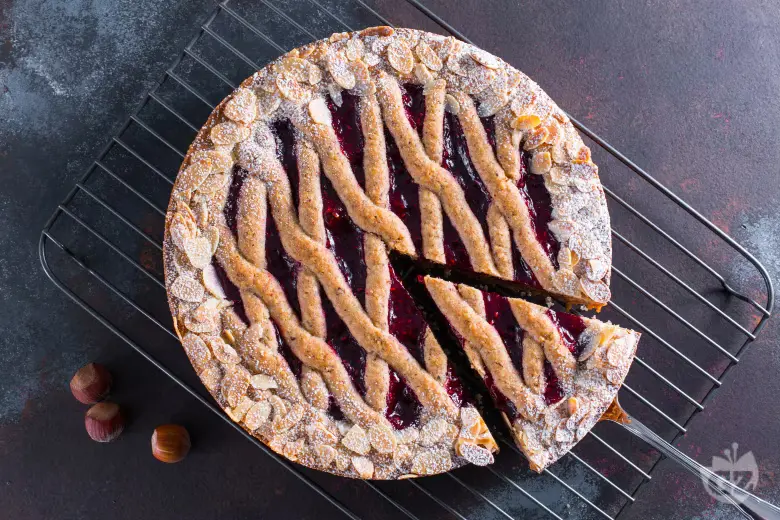

## Ingredienti

### Torta

| Ingredienti                  | Ingredienti             |
| ---------------------------- | ----------------------- |
| **300 g** - Farina 00 | **250 g** - Farina di nocciole |
| **250 g** - Burro | **200 g** - Zucchero |
| **2** - Uova | **\\(\frac{1}{2}\\)** - Limone |
| **1** - Baccello di vaniglia | **10 g** - Cacao amaro in polvere |
| **10 g** - Brandy | **1 pizzico** - Chiodi di garofano macinati |
| **1 cucchiaino** - Cannella in polvere | **3 g** - Lievito in polvere per dolci |
| **1 pizzico** - Sale | |

### Copertura

| Ingredienti                  | Ingredienti             |
| ---------------------------- | ----------------------- |
| **300 g** - Confettura di lamponi | Mandorle in scaglie |
| Zucchero a velo | |

## Procedimento

> Preriscadare il forno a 180°

1. Per preparare la Linzer torte, in una ciotola ampia versate il burro morbido, lo zucchero, il sale e lavorate il tutto con le fruste elettriche per un paio di minuti. 
1. Unite le uova a temperatura ambiente e lavorate sino a completo assorbimento. 
1. Aggiungete al composto le spezie, la polpa del baccello di vaniglia e la buccia di limone grattugiata. 
1. Sempre mantenendo in azione le fruste continuate aggiungendo le farine, il lievito, il cacao in polvere e il brandy. Dovrete ottenere un composto morbido e omogeneo.
1. Trasferite tre quarti dell’impasto in un sac-à-poche con bocchetta da 15 mm. Ricoprite il fondo di uno stampo di 24 cm di diametro (possibilmente con cerchio apribile), creando cerchi concentrici e iniziando dal perimetro dello stampo. 
1. Ora farcite la base con la confettura lasciando 1,5 cm di spazio libero dal bordo. Sicuramente avanzerà dell'impasto che terrete da parte in questo sac-à-poche.
1. Trasferite la parte di impasto rimanente in un altro sac-à-poche con bocchetta da 1 cm e realizzate le losanghe decorative. 
1. Riprendete il primo sac-à-poche e realizzate il bordo della crostata. 
1. Cospargete il bordo con mandorle a lamelle.
1. Cuocete la Linzer in forno statico preriscaldato a 180° per 50-55 min. 
1. Sfornate e lasciate intiepidire prima di sformare la vostra Linzer torte. 
1. Una volta fredda decorate con poco zucchero a velo

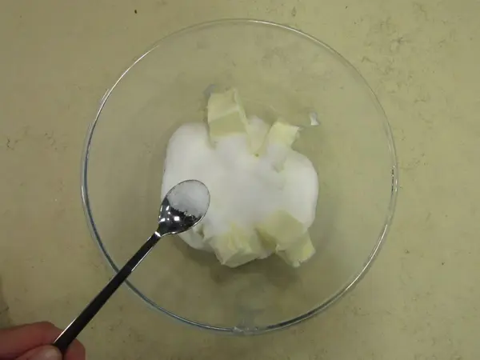
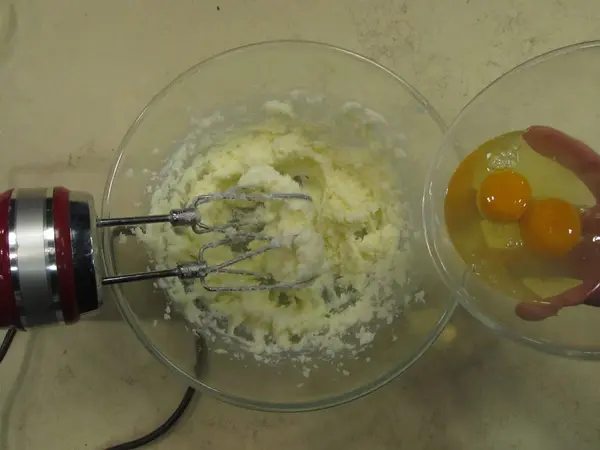
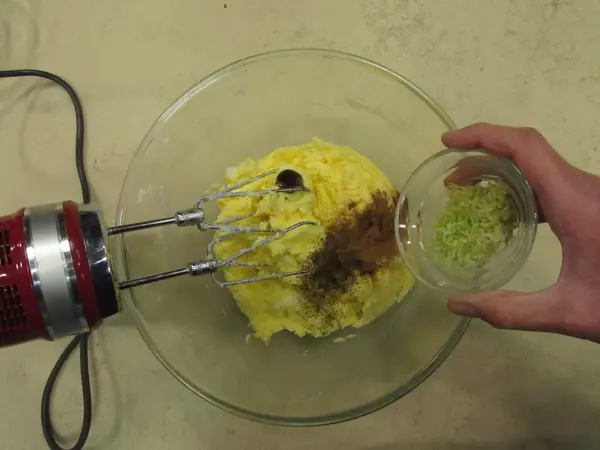
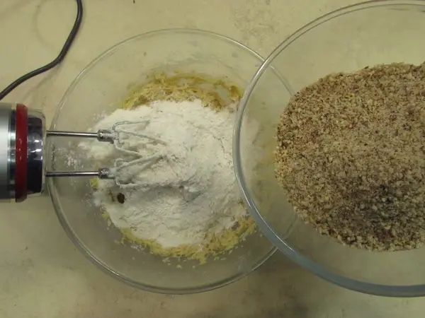
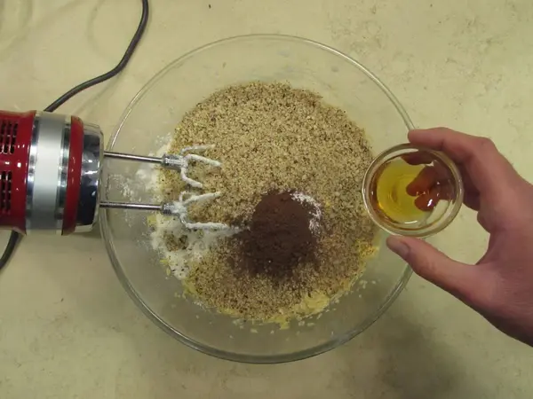

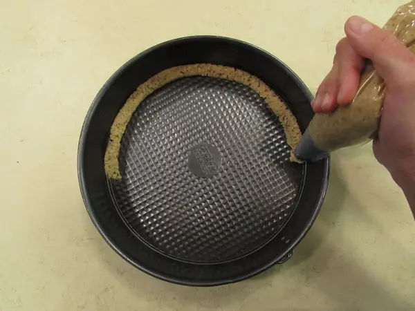
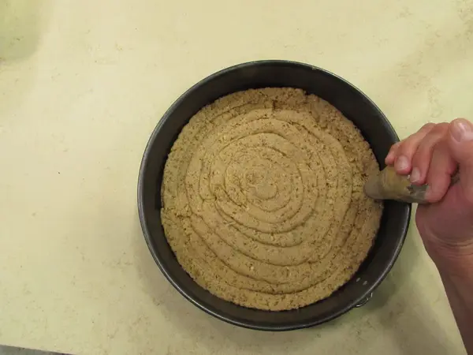
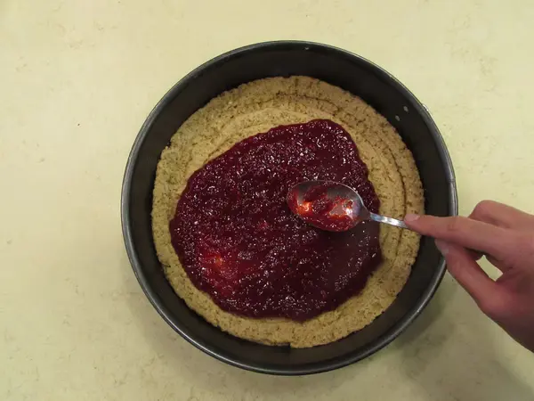
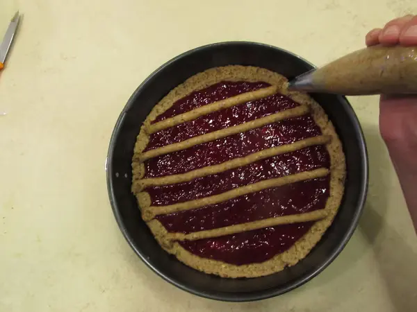
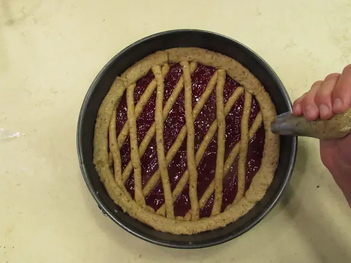
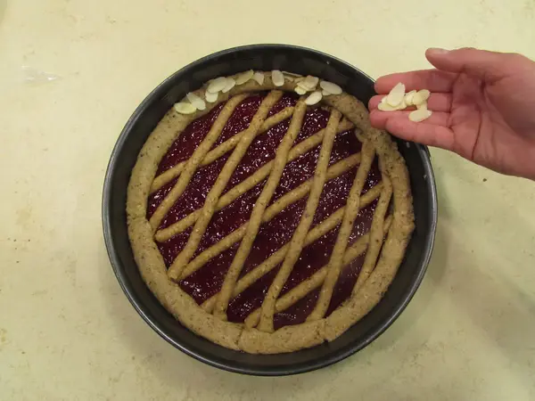
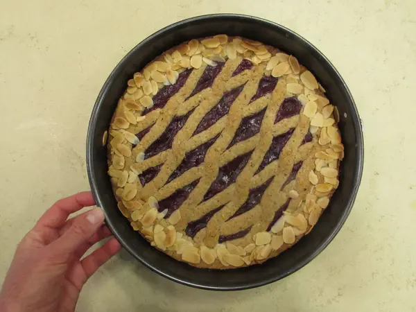
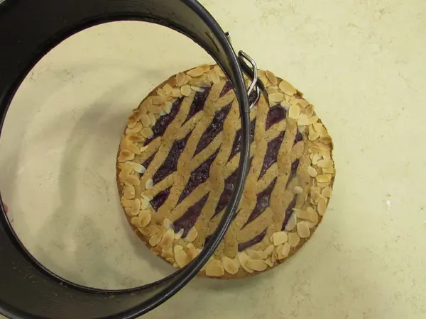
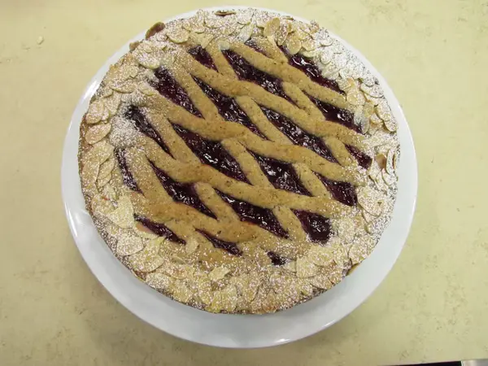
