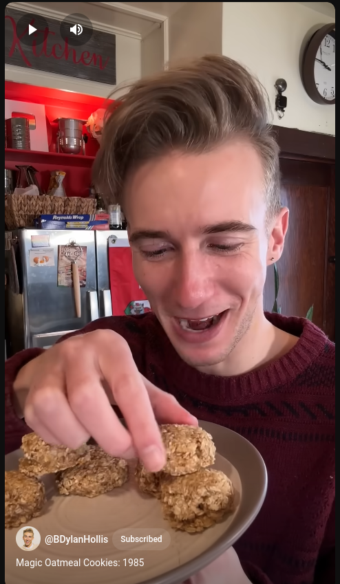

# Magic Oatmeal Cookies: 1985

## Ingredienti

| Ingredienti                  | Ingredienti             |
| ---------------------------- | ----------------------- |
| **1** - Ripe banana (or 1 cup apple sauce) | **1 cup** - Quick oats |

## Procedimento

> Preriscaldare il forno a 175°

1. Si schiaccia la banana in una ciotola
1. Si mescola l'oatmeal
1. Si Formano delle palline in una teglia con carta forno e si schiacciano legermente
1. Si infornano a 175° per circa 15 minuti

<iframe width="315" height="560"
src="https://www.youtube.com/embed/4ZeK_iLauko"
title="YouTube video player"
frameborder="0"
allow="accelerometer; autoplay; clipboard-write; encrypted-media; gyroscope; picture-in-picture; web-share"
allowfullscreen></iframe>
