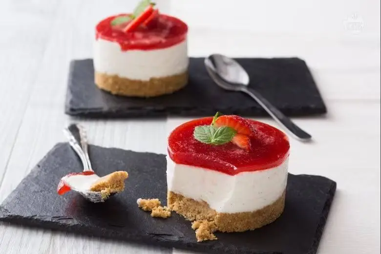

# Mini cheesecake

> [https://ricette.giallozafferano.it/Mini-cheesecake.html](https://ricette.giallozafferano.it/Mini-cheesecake.html)

{{hi:Biscotti}}
{{hi:Philadelphia}}
{{hi:Ricotta}}
{{hi:Gelatina}}
{{hi:Fragole}}

## Ingredienti

| Ingredienti                  | Ingredienti             |
| ---------------------------- | ----------------------- |
| **150 g** - Biscotti digestive | **12 g** - Gelatina in fogli |
| **60 g** - Burro | **1** - Baccello di vaniglia |
| **125 g** - Formaggio spalmabile | **180 g** - Fragole |
| **125 g** - Ricotta | **30 g** - Zucchero di canna |
| **35 g** - Zucchero a velo | Menta |
| **100 g** - Panna fresca liquida | |

## Procedimento

1. Per realizzare le mini cheesecake per prima cosa occupatevi della base: in un mixer versate i biscotti secchi e frullateli finemente, poi trasferiteli in una ciotola, aggiungete il burro fuso e mescolate con un cucchiaio di legno così da ottenere un composto umido.
1. Adagiate dei coppapasta del diametro di 7,5 cm e con un bordo di 4,5 cm su un vassoio rivestito con carta forno, versate all’interno di ciascuno \\( \frac{1}{4} \\) delle briciole di biscotto e compattate bene il composto con il dorso del cucchiaio per formare la base. Ponete il tutto a raffreddare in frigorifero per almeno mezz’ora. 
2. Ora occupatevi della crema: in una ciotola con acqua fredda ammollate i fogli di gelatina per circa 10 minuti, in modo da ammorbidirli.
1. Prendete 50 g di panna dalla dose totale e ponetela in un pentolino a scaldare, una volta che la gelatina si sarà ammorbidita, strizzatela e scioglietela nella panna calda a fuoco spento mescolando con un frusta così non si formeranno i grumi. Lasciate raffreddare.
1. In una ciotola versate la ricotta, il formaggio spalmabile e lo zucchero a velo, montate con le fruste elettriche per amalgamare e poi aromatizzate con i semi del baccello di vaniglia.
1. Versate anche la restante dose di panna e quella nel pentolino, dove avete sciolto la gelatina. Continuate a montare il composto con le fruste fino a quando non sarà morbido e spumoso.
1. Riprendete gli stampini con le basi, riempiteli fino al bordo con la crema, livellando la superficie con il dorso di un cucchiaio. Lasciate rassodare le mini cheesecake per almeno 4 ore in frigorifero.
1. Mentre i dolcetti rassodano, preparate la coulis: lavate e asciugate le fragole, quindi tagliatele a pezzi e versatele in un pentolino, aggiungete lo zucchero di canna e cuocete a fuoco basso per 10 minuti, terminata la cottura le fragole saranno morbide. Nel frattempo lasciate ammorbidire la gelatina nell’acqua fredda.
1. Quanto le fragole saranno pronte, passatele ancora calde attraverso un colino, pressate con la spatola e raccogliete la purea in una ciotola. Aggiungete la gelatina strizzata e mescolate con la frusta per scioglierla con cura. 
2. Riprendete le mini cheesecake rassodate e distribuite nei 4 stampi la coulis. 
3. Riponete nuovamente in frigo a rassodare per 1 ora e poi servite le vostre mini cheesecake guarnendole con foglioline di menta fresca e fettine di fragole fresche.

