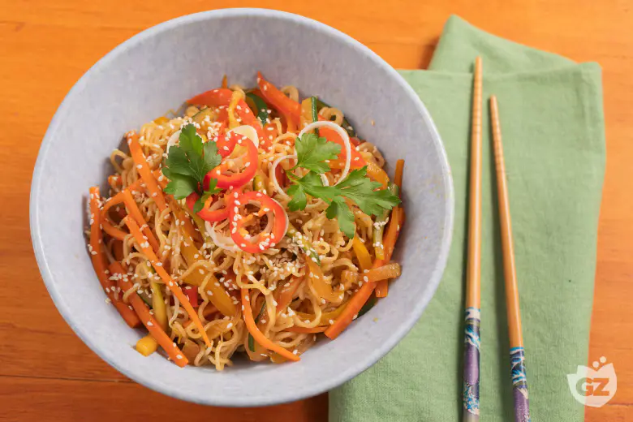

# Noodles con verdure

{{hi:Noodles}}

## Ingredienti

### Noodles

| Ingredienti                  | Ingredienti             |
| ---------------------------- | ----------------------- |
| **250 g** - Noodles | **300 g** - Porri |
| **250 g** - Carota | **100 g** - Cipolle bianche |
| **150 g** - Peperoni | **50 g** - Germogli di soia |
| **150 g** - Peperoni gialli | **30 g** - Olio di semi |
| **400 g** - Zucchine | |

### Salsa

| Ingredienti                  | Ingredienti             |
| ---------------------------- | ----------------------- |
| **75 g** - Salsa di soia | **10 g** - Zenzero |
| **30 g** - Mirin | **1 spicchio** - Aglio |

### Guarnizione

| Ingredienti                  | Ingredienti             |
| ---------------------------- | ----------------------- |
| **2** - Peperoncini freschi | Semi di sesamo |
| **1 mazzetto** - Coriandolo | |

## Procedimento

1. Per preparare i noodles con verdure, come prima cosa dedicatevi al taglio delle verdure. Spuntate e pelate le carote, poi tagliatele a julienne allo spessore di 3 mm. Fate la stessa cosa per le zucchine.
2. Eliminate il picciolo, i semi e i filamenti interni dei peperoni, quindi tagliateli a julienne.
3. Tagliate via la parte verde del porro, affettatelo a rondelle di 5 mm di spessore. Tagliate anche il peperoncino a rondelle e la cipolla a julienne.
4. In una ciotola versate la salsa di soia e aggiungete il mirin, unite anche lo zenzero e l’aglio grattugiati.
5. In una padella wok versate l’olio di semi di girasole e, una volta che sarà ben caldo, aggiungete la cipolla e fate rosolare per 3 minuti. 
6. Unite le carote e le zucchine.
7. Continuate con i peperoni, quindi regolate di sale e fate cuocere per 10 minuti, mescolando di tanto in tanto. Le verdure dovranno risultare cotte ma ancora croccanti. 
8. Spegnete il fuoco e versate in padella la salsa di soia.
9. Unite anche i germogli di soia e mescolate. 
10. Cuocete i noodles in abbondante acqua bollente salata, per il tempo riportato sulla confezione, scolateli, trasferiteli in padella e mescolate nuovamente.
11. Impiattate e completate con qualche anello di porro, il peperoncino, una spolverata di semi di sesamo e qualche fogliolina di coriandolo. 
12. I noodles con verdure sono pronti per essere gustati.
