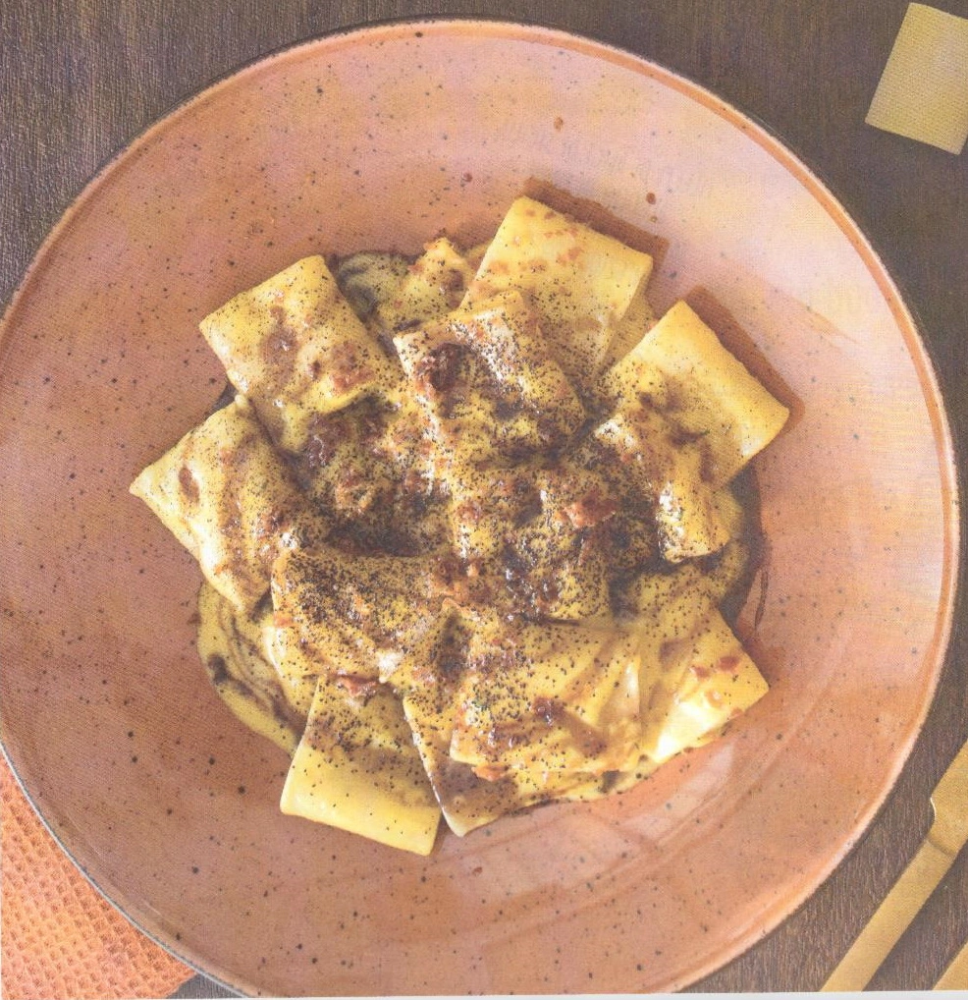

# Paccheri alla zucca, prosciutto crudo croccante, riduzione di Sangiovese e polvere di cipolla ricavata dai suoi scarti

{{hi:Paccheri}}
{{hi:Zucca}} 
{{hi:Prosciutto crudo}}

## Ingredienti

| Ingredienti                  | Ingredienti             |
| ---------------------------- | ----------------------- |
| **320 g** - Paccheri  | **\\( \frac{1}{2} \\) litro** - Vino Sangiovese |
| **300 g** - zucca | **2 cucchiai** - Zucchero |
| **100 g** - Prosciutto di Parma | **1 Cucchiaio** - Miele |
| **20 g** - pecorino | Erbe aromatiche |
| **20 g** - parmigiano | Olio |
| **1** - Cipolla ramata | Sale e pepe |
| **Brodo vegetale** - | |

## Procedimento

1. Tagliare finemente il prosciutto crudo e rosolarlo in una casseruola con un filo d'olio. Quando risulterà croccante toglierlo e tenerlo da parte.
1. Nella stessa casseruola aggiungere la cipolla tagliata a julienne dopo averla privata della parte esterna e dei primi due veli, che andranno messi su una placca da forno a 180°C per 20 minuti.
1. Quando risulteranno ambrati, raffreddarli prima di procedere a sbriciolarli con le mani. Quando la cipolla in casseruola risulterà ben stufata, aggiungere la zucca tagliata a cubetti, sale, pepe e coprire con brodo. 
1. Cuocere a fiamma media per 20 minuti, fino a quando la zucca risulterà morbida. 
1. Nel frattempo preparare la riduzione al Sangiovese mescolando in un pentolino \unit[\nicefrac{1}{2}]{l} di vino Sangiovese, 2 cucchiai di zucchero e 1 di miele. Far cuocere a fiamma media finché il liquido non si riduce della metà e poi lasciare da parte. 
1. Cuocere la pasta in acqua salata e scolarla due minuti prima del tempo indicato per ultimare la cottura nella casseruola con la zucca.
1. A cottura ultimata, mantecare con parmigiano, pecorino e versare un pò di riduzione di Sangiovese a filo con un cucchiaio. 
1. Aggiungere infine un pò d'olio, le erbe aromatiche e servire con il prosciutto croccante e la polvere di cipolla.
