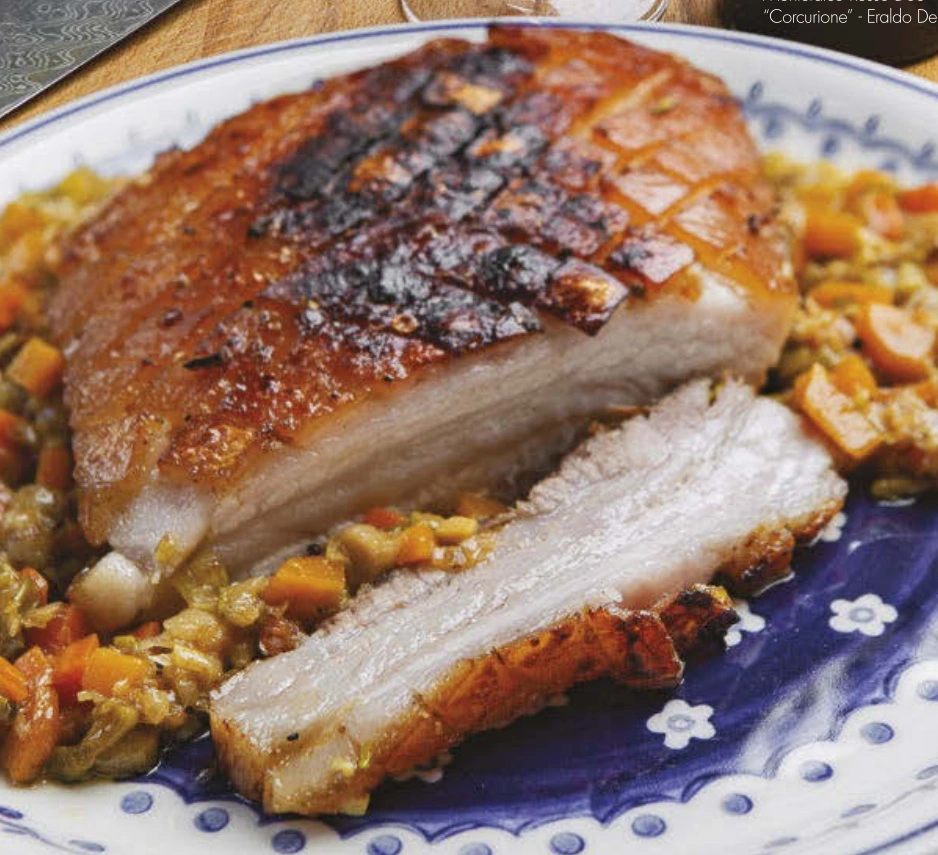
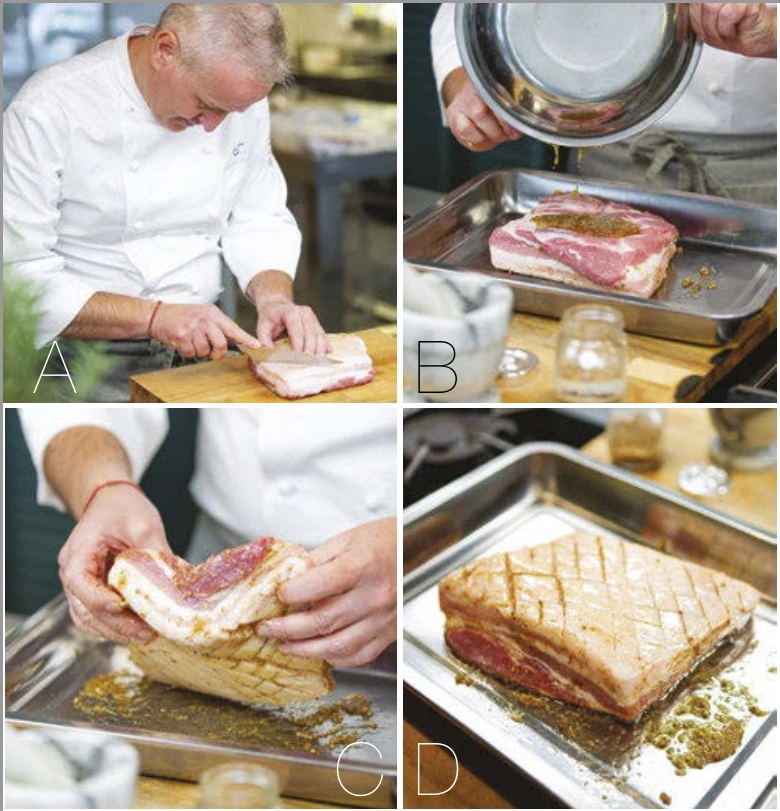
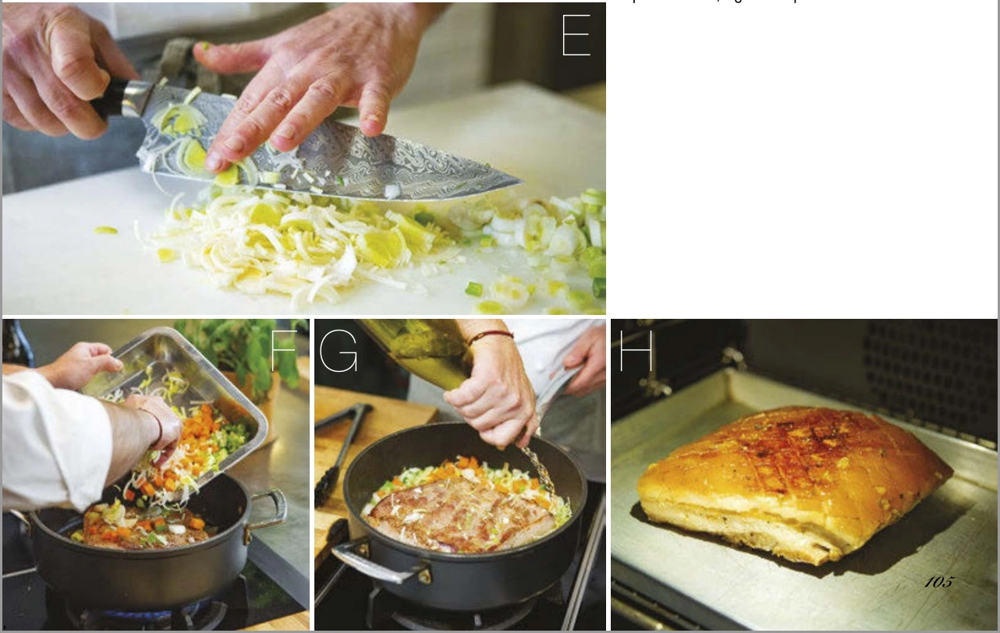

# Pancetta di maiale brasata al coriandolo

{{hi:Pancetta fresca}}

## Ingredienti

| Ingredienti                  | Ingredienti             |
| ---------------------------- | ----------------------- |
| **1,2 Kg** - Pancetta di maiale fresca con la cotenna | **2 cucchiai** - Zucchero di canna |
| **6** - Carote | **750 ml** - Vino bianco |
| **6** - Cipollotti freschi | Olio evo |
| **3** - Porri | Sale e pepe |
| **2 cucchiai** - Coriandolo in polvere | **** - |

## Procedimento

> Preriscaldare il forno a 220°

1. Praticate dei tagli sulla cotenna della pancetta di maiale (foto A). Mescolate il coriandolo con lo zucchero e 100 ml di olio; versate l'emulsione ottenuta sulla pancetta (foto B), massaggiatela e giratela (foto C e D); coprite con la pellicola e lasciate riposare per almeno 8 ore in frigorifero.
1. Pelate le carote, spuntatele e tagliatele a cubetti; pulite i porri e i cipollotti e affettateli finemente (foto E). Fate rosolare la pancetta di maiale in una casseruola con un velo di olio da entrambi i lati, aggiungete le verdure (foto F) e lasciatele dorare per qualche minuto. Sfumate con il vino bianco (foto G), aggiustate di sale e di pepe, incoperchiate e proseguite la cottura per 90 minuti, rigirando spesso la carne.
1. A fine cottura, trasferite la pancetta su una placca da forno con il lato della cotenna verso l'alto e infornate a 220 °C per 10 minuti, quindi accendete il grill e fate cuocere per pochi minuti finché la cotenna non sarà dorata e croccante (foto H).
1. Intanto rimettete la casseruola sul fuoco e lasciate ridurre il fondo di cottura;  aggiustate di sale e di pepe. Sfornate la pancetta e trasferitela in un piatto da portata, quindi cospargete con il fondo di cottura ridotto e servite, tagliata a fette.

