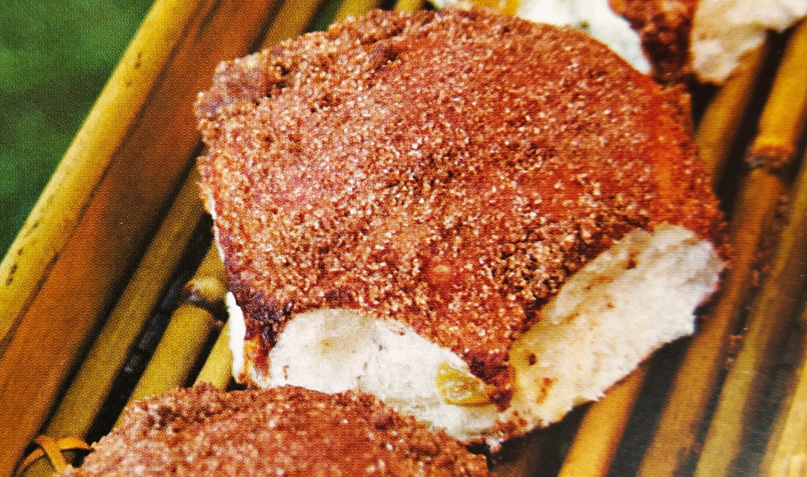

# Pane con l'uvetta

{{hi:Uva passa}}

## Ingredienti

| Ingredienti                  | Ingredienti             |
| ---------------------------- | ----------------------- |
| **650 g** - Farina  | **400 g** - Latte intero |
| **15 g** - Sale | **120 g** - Burro ammorbidito |
| **25 g** - Zucchero | **140 g** - Uva passa |
| **7 g** - Lievito istantaneo (**10 g** lievito secco) |  |

## Procedimento

> Preriscaldare il forno a 190°

1. **Impasto**
   1. Mescolate la farina, il sale, lo zucchero, il lievito e il latte nell'impastatrice azionata a bassa velocità per 4 minuti.
   2. Quando gli ingredienti risulteranno bene incorporati portate a velocità media e aggiungete metà del burro ammorbidito. Continuate a lavorare l'impasto per 1 minuto.
   3. Aggiungete il resto del burro e l'uva passa e continuate a impastare per altri 5 minuti. All'inizio sentirete chiaramente il rumore del burro che sbatte contro le pareti del cestello. Verso la fine, quando il burro sarà completamente incorporato nell'impasto, il rumore dovrebbe sparire.
2. **Lievitazione**
   1. Scaricate l'impasto dall'impastatrice nel contenitore (preventivamente spennellato d'olio) dove avverrà la lievitazione. La temperatura ideale dell''impasto dovrebbe essere 26°.
   2. Coprite il contenitore con un coperchio o con la pellicola trasparente e lasciate riposare per 45 minuti.
3. **Piegature di rinforzo**
   1. Al termine dei 45 minuti di lievitazione eseguite una serie di piegature di rinforzo, quindi riponete l'impasto nel contenitore e lasciate riposare per altri 45 minuti.
4. **Spezzatura** 
   1. Dividete l'impasto in 12 pezzi da 90 grammi ciascuno aiutandovi con la spatola e la bilancia
5. **Formatura**
   1. Scaldate il forno a 190 °C senza pietra refrattaria né vaschetta del vapore.
   2. Formate delle palline di impasto e disponetele sulla teglia rivestita di carta forno.
6. **Lievitazione finale** 
   1. Coprite la teglia con pellicola trasparente e lasciate lievitare fino a che i panini non sono raddoppiati di volume.
7. **Cottura**
   1. Prima di infornare inumidite i panini con il nebulizzatore quindi ricopriteli generosamente di cannella e spezie.
   2.  Infornate e fate cuocere per 20-25 minuti.   

> **Lievito madre**: Usare il 30% di lievito madre, quindi 200 g di lievito madre con 450 g di farina e togliere 50 g dal latte per un totale di 350g