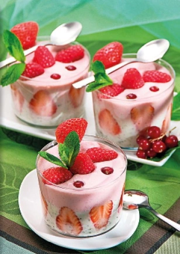

# Panna alla vaniglia con fragole e lamponi

{{hi:Panna}}
{{hi:Fragole}}
{{hi:Lamponi}}

## Ingredienti

| Ingredienti                  | Ingredienti             |
| ---------------------------- | ----------------------- |
| **3** - Tuorli | **300 g** - Fragole |
| **130 g** - Zucchero semolato | **150 g** - Lamponi |
| **45 g** - Farina | **50 g** - Ribes sgranati |
| **450 ml** - Latte | **1 cucchiaio** - Zucchero a velo |
| **300 ml** - Panna fresca | **2 g** - Gelatina in fogli |
| **\\(\frac{1}{2}\\)** - Baccello di vaniglia | **1 rametto** - Menta |

## Procedimento

1. Fai ammorbidire la gelatina in acqua fredda per 5 minuti. Taglia 100 g di fragole a metà e disponile in piedi lungo le pareti di 4 bicchieri.
1. Monta 150 ml di panna ben fredda con lo zucchero a velo aggiungendo i semini di vaniglia prelevati dal baccello inciso a metà e lasciandola morbida. Sciogli la gelatina a bagnomaria senza strizzarla e falla intiepidire, poi incorporala delicatamente alla panna, distribuiscila sul fondo dei bicchieri e lasciala in frigo.
1. Frulla le fragole rimaste, passale al setaccio e mettile al fresco.
1. Mescola i tuorli con lo zucchero e incorpora la farina e il latte, a filo e mescolando. Cuoci il composto a fuoco medio per 10 minuti circa fino a ottenere una crema densa, poi falla raffreddare rapidamente in un bagnomaria ghiacciato. Unisci il passato di fragole e la rimanente panna leggermente montata.
1. Distribuisci i lamponi e i ribes nei bicchieri, coprili con la crema e poi lascia i bicchieri in frigo per 2 ore. Servi a piacere con altri ribes e lamponi, guarnendo con ciuffetti di menta.

