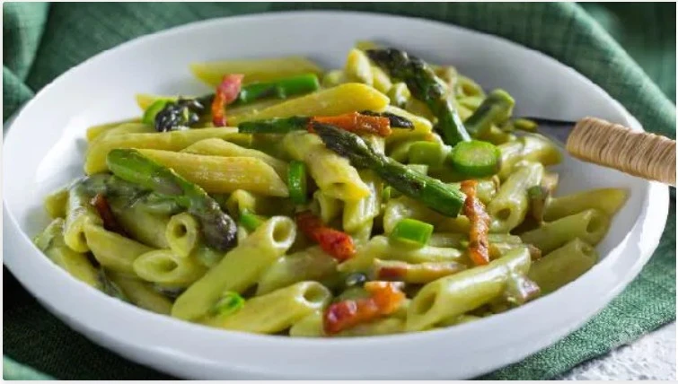

# Pasta con asparagi e pancetta

{{hi:Asparagi}}
{{hi:Pancetta}}

## Ingredienti

| Ingredienti                  | Ingredienti             |
| ---------------------------- | ----------------------- |
| **320 g** - Penne Rigate  | **20 g** - Olio evo |
| **700 g** - Asparagi | **100 g** - Acqua |
| **100 g** - Pancetta | Sale e pepe |
| **1** - scalogno |  |

## Procedimento

1. Per preparare la pasta con asparagi e pancetta, eliminate la parte finale degli asparagi più coriacea, tagliate i gambi a rondelle, mentre le punte tagliatele a metà e mettetele da parte.
1. Mondate e tritate finemente lo scalogno, tagliate a stricioline la pancetta. Mettete a bollire l'acqua per la pasta da salare a bollore, nel mentre scaldate un filo d'olio in una padella capiente.
1. Unite lo scalogno tritato e lasciate rosolare a fuoco medio per 2-3 minuti, mescolando di tanto in tanto. Aggiungete i gambi degli asparagi a rondelle, salate, pepate a piacere. Sfumate con un mestolo di acqua calda(presa dalla pentola per la cottura della pasta). Cuocete il tutto per circa 10 minuti aggiungendo un pò di acqua calda al bisogno. 
1. Una volta che gli asparagi saranno cotti, prelevatene circa \\( \frac{2}{3} \\), trasferiteli in un bicchiere alto insieme a 20 g olio, 100 g di acqua e frullate con un frullatore a immersione.
1. Dovrete ottenere una crema liscia. Tenete la crema da parte, mentre versate la pancetta all'interno della padella utilizzata per la cottura degli asparagi e lasciate rosolare per 2 minuti a fuoco medio, mescolando di tanto in tanto. Unite anche le punte d'asparago e lasciate rosolare ancora per 5 minuti.
1. Nel frattempo cuocete la pasta al dente. Tenete da parte qualche strisciolina di pancetta e punta di asparago rosolati, quindi versate anche la crema di asparagi all’interno della padella con il condimento, aggiungete anche le rondelle di asparagi.
1. Scolate la pasta direttamente in padella e mantecate per un paio di minuti sino ad ottenere una pasta ben condita e cremosa. Impiattate, aggiungete del pepe grattugiato fresco a piacere e decorate ciascun piatto da portata con le punte di asparago e le listarelle di pancetta tenute da parte!
