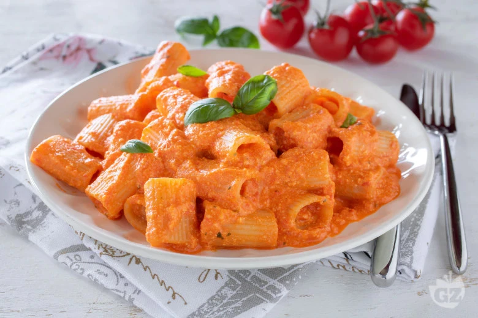

# Pasta con crema di peperoni e ricotta

{{hi:Peperone}}
{{hi:Ricotta}}

## Ingredienti

| Ingredienti                  | Ingredienti             |
| ---------------------------- | ----------------------- |
| **160 g** - Mezze Maniche Rigate  | Basilico  |
| **250 g** - Peperoni rossi | **1 spicchio** - Aglio |
| **130 g** - Ricotta di pecora | Olio evo |
| **70 g** - Pomodorini ciliegino | Sle |

## Procedimento

1. Per realizzare la pasta con crema di peperoni e ricotta per prima cosa lavate i peperoni, eliminate la calotta superiore con il piccioli, divideteli a metà ed estraete i semini interni, quindi tagliateli a listarelle. Lavate e tagliate a metà i pomodorini.
1. In una padella scaldate un filo di olio di oliva con uno spicchio di aglio per 2-3 minuti a fuoco dolce. 
1. Versate i peperoni e i pomodorini, salate, coprite con il coperchio e cuocete per 10 minuti. Ponete sul fuoco un tegame colmo di acqua salata e portate al bollore.
1. A cottura ultimata, eliminate l'aglio e tenete da parte. Cuocete la pasta al dente.
1. Schiacciate bene con una forchetta la ricotta.
1. Versate i peperoni e i pomodori in un bicchiere alto, aggiungete le foglie di basilico e frullate con un mixer a immersione; Dovete ottenere una crema omogenea. 
1. Versate la crema nella padella usata per la cottura delle verdure, scolate qui anche la pasta.
1. Unite la ricotta e saltate il tutto giusto il tempo di amalgamare il condimento. 
1. Servite la pasta con crema di peperoni e ricotta ben calda.
