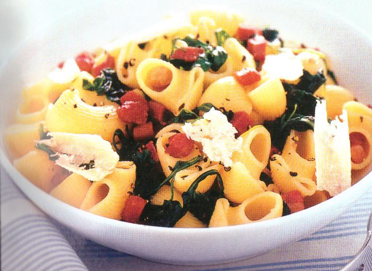

# Pasta con rucola e bacon

{{hi:Rucola}}
{{hi:Bacon}}

## Ingredienti

| Ingredienti                  | Ingredienti             |
| ---------------------------- | ----------------------- |
| **400 g** - Pipe rigate | Olio evo |
| **200 g** - Rucola | **30 g** - Parmigiano reggiano |
| **100 g** - Bacon o pancetta affumicata (singola fetta) | Sale e pepe |

## Procedimento

1. Lessa la pasta. Porta a ebollizione abbondante acqua nella pentola, salala, immergici le pipe rigate e falle cuocere per circa 5 minuti, quindi unisci la rucola mondata, lavata e tagliata a listarelle e prosegui la cottura per il tempo indicato sulla confezione della pasta, premurandoti che rimanga al dente.
1. Prepara il bacon. Mentre la pasta cuoce, taglia il bacon a dadini, mettili in una larga padella antiaderente e falli rosolare con 2 cucchiai di olio per circa 2 minuti,
1. mescolando con un cucchiaio di legno.
1. Completa e servi. A cottura ultimata, scola la pasta con la rucola e trasferiscila direttamente nella padella con il bacon, fai saltare per qualche istante e insaporisci con abbondante pepe macinato al momento. 
1. Suddividi la pasta nei piatti individuali, completa con qualche scaglia sottile di parmigiano reggiano e porta subito in tavola.

