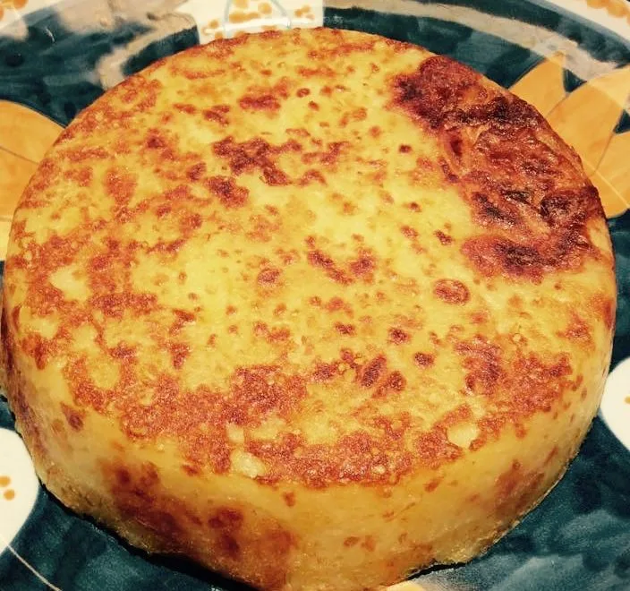

# Patate in tecia

{{hi:Patate}}

## Ingredienti

| Ingredienti                  | Ingredienti             |
| ---------------------------- | ----------------------- |
| **1 Kg** - Patate | Sale |
| **1 noce** - Burro | Olio evo |

## Procedimento

1. Mettere un filo d'olio sul fondo della pentola. 
1. Dopo averle sbucciate affettare le patate direttamente in pentola, facendo delle fette sottili (dovete intravedere la lama del coltello sotto la fetta di patata). Se preferite usate una mandolina, l'importante è mantenere uno spessore di circa 1-2mm. 
1. A metà patate mettere un pizzico di sale e continuare affettando il resto delle patate. 
1. Quando sono tutte affettate mettere un altro pizzico di sale, un filo generoso di olio e una noce di burro. 
1. Coprire con coperchio e mette su fuoco moderato. 
1. Mescolarle spesso con mestolo di legno, si devono cuocere bene ma non devono fare crostino e soprattutto non devono attaccarsi sul fondo, quando sono ben cotte e spappolate (ci vogliono circa 20 minuti) schiacciarle bene bene sul fondo con il mestolo di legno, livellandole. 
1. Togliere il coperchio alzare il fuoco a fiamma viva e farle andare 6-8 minuti senza mai toccarle. 
1. Spegnere, smuovere un po la pentola per vedere se si staccano dal fondo, capovolgerle su un piatto da portata, e buon appetito!
