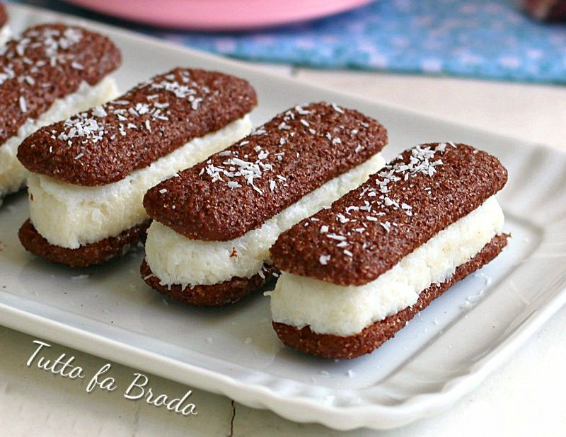

# Pavesini al cacao con cocco e ricotta

{{hi:Pavesini}}
{{hi:Cocco}}

## Ingredienti

| Ingredienti                  | Ingredienti             |
| ---------------------------- | ----------------------- |
| **250 g** - Ricotta | **200 g** - Farina di cocco |
| Pavesini | **80 g** - Zucchero semolato o a velo |

## Procedimento

1. In una terrina larga e capiente versate la ricotta ben setacciata insieme allo zucchero e lavorate bene con l’aiuto di un cucchiaio questi due ingredienti fino a che lo zucchero è ben sciolto
1. Unite la farina di cocco e mescolatela bene da prima con il cucchiaio e poi lavorate con le mani, ottenete un composto lavorabile e abbastanza sodo se necessario regolatevi aggiungendo 1-2 cucchiai di farina di cocco.
1. Ora prendete i pavesini, e distribuite sopra un po di composto al cocco e ricotta, modellandolo con le mani o con l’aiuto di una spatolina, coprite con un altro pavesino per creare il coperchio e continuate cosi fino al termine degli ingredienti
1. Sistemate i pavesini su un vassoietto, distribuite sopra la farina di cocco, riponeteli in frigo per farli rassodare e serviteli belli freschi.

