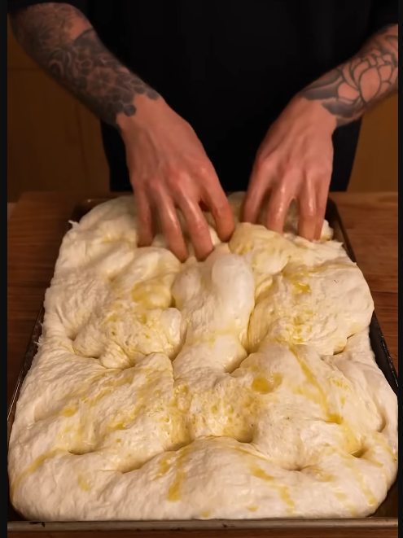

# Pesto and Bocconcini Sheet Pan Focaccia

{{hi:Pomodoro}}

## Ingredienti

| Ingredienti                  | Ingredienti             |
| ---------------------------- | ----------------------- |
| **1,2 Kg** - Bread flour | **100 ml** - Pesto |
| **24 g** - Salt | **200 g** - Mozzarelline |
| **100 ml** - Olive oil | Sale grosso |
| **14 g** - Dry yeast |  |

## Procedimento

> Preheat a fan-forced oven to 200°C (390°F) 

1. Add 950ml of warm water (32°C) to a large bowl. 
1. Add the dry yeast and mix until dissolved. 
1. Once the yeast is dissolved, add the salt and stir through.
1. Pour in around 2 tablespoons (30ml) of olive oil and add the flour. Mix until combined. This is a high hydration dough, so you're not aiming for a smooth dough—just mix until everything is incorporated and the flour is hydrated. 
1. Cover the bowl with a tea towel and let it rest for 30 minutes.
1. After 30 minutes, uncover the dough. With a wet hand, stretch one corner of the dough and fold it over itself. Repeat 3-4 times until the dough is folded over itself completely. 
1. Cover the dough with a tea towel and let it rest for another 30 minutes. 
1. **Repeat this process three more times**.
1. After the fourth and final round of stretching and folding, let the dough rest for 30 minutes. 
1. Prepare your baking tray by lining it with baking paper and drizzling around 40ml (1.4 fl oz) of olive oil in the bottom of the tray. 
1. Pour in the dough, which should be light and airy by now. Using well-oiled hands, stretch the dough to cover all corners of the pan. If it doesn't stretch fully, cover it with a tea towel, let it rest for 5 minutes, and try again. 
1. Once the dough fills the tray, cover with the tea towel and let it proof for 30 minutes.
5. Preheat a fan-forced oven to 200°C (390°F) or 220°C (430°F) for a conventional oven.
6. After 30 minutes, remove the tea towel. Drizzle some more olive oil over the top and use your fingers to create dimples throughout the dough. 
1. Add the bocconcini, pesto, and a big pinch of flaky salt.
7. Place the bread in the oven and bake for 25-30 minutes or until golden brown and crispy.

<iframe width="315" height="560"
src="https://www.youtube.com/embed/sCXodpSVXFk"
title="YouTube video player"
frameborder="0"
allow="accelerometer; autoplay; clipboard-write; encrypted-media; gyroscope; picture-in-picture; web-share"
allowfullscreen></iframe>

