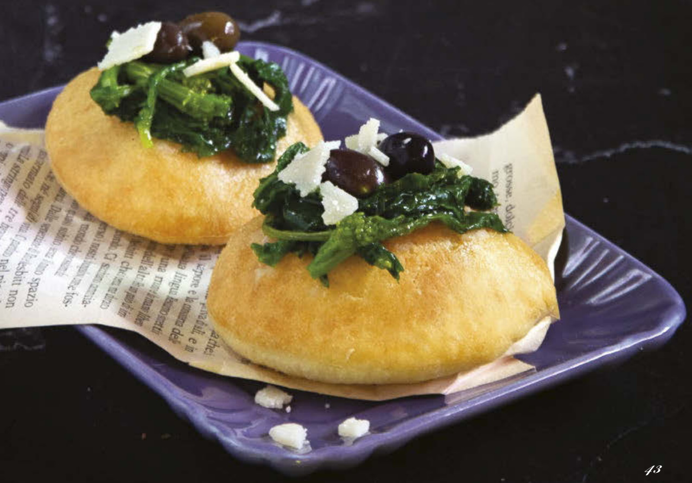

# Pizzelle con cime di rapa olive e grana

{{hi:Cime di rapa}}
{{hi:Olive}}
{{hi:Parmigiano reggiano}}

## Ingredienti

| Ingredienti                  | Ingredienti             |
| ---------------------------- | ----------------------- |
| **500 g** - Farina | **500 g** - Cime di rapa |
| **\\( \frac{1}{2} \\) bustina** - Lievito di birra secco | **1 spicchio** - Aglio |
| **1 cucchiaino** - Zucchero | **1** - Peperoncino |
| **100 g** - sale | Olive taggiasche |
| **1 cucchiaio** - Olio evo | Scaglie di parmigiano |
| **300 ml** - Acqua tiepida | Olio evo |
| Olio di semi | Sale |

## Procedimento

1. Mescolate in una ciotola la farina con il lievito, il sale e lo zucchero; versate l’olio e l’acqua tiepida, poca alla volta, e impastate energicamente per una decina di minuti fino a ottenere un composto liscio ed elastico. Formate una palla, avvolgetela con la pellicola trasparente e lasciate lievitare in un luogo tiepido per circa 90 minuti, fino al raddoppio del volume iniziale.
1. Mondate le cime di rapa, lavatele accuratamente e lessatele in acqua bollente e leggermente salata; scolatele, passatele subito in acqua e ghiaccio e poi lasciatele raffreddare. Strizzatele per bene e tenetele da parte.
1. Trascorso il tempo di lievitazione, stendete l’impasto a uno spessore di circa 1 cm e con un tagliapasta rotondo ricavate tanti dischetti uniformi. Copriteli con un telo e lasciateli lievitare per altri 30 minuti.
1. In una padella fate rosolare lo spicchio di aglio schiacciato e il peperoncino con un filo di olio; aggiungete le cime di rapa e ripassatele per bene. Spegnete il fuoco e regolate di sale.
1. Fate scaldare abbondante olio di semi in una padella capiente, quindi tuffate le pizzelle e friggetele, girandole di tanto in tanto, finché non saranno ben dorate. Scolatele e fatele asciugare su carta assorbente da cucina. Distribuite sopra le cime di rapa e qualche oliva taggiasca. Cospargete con le scaglie di grana e servite subito.
