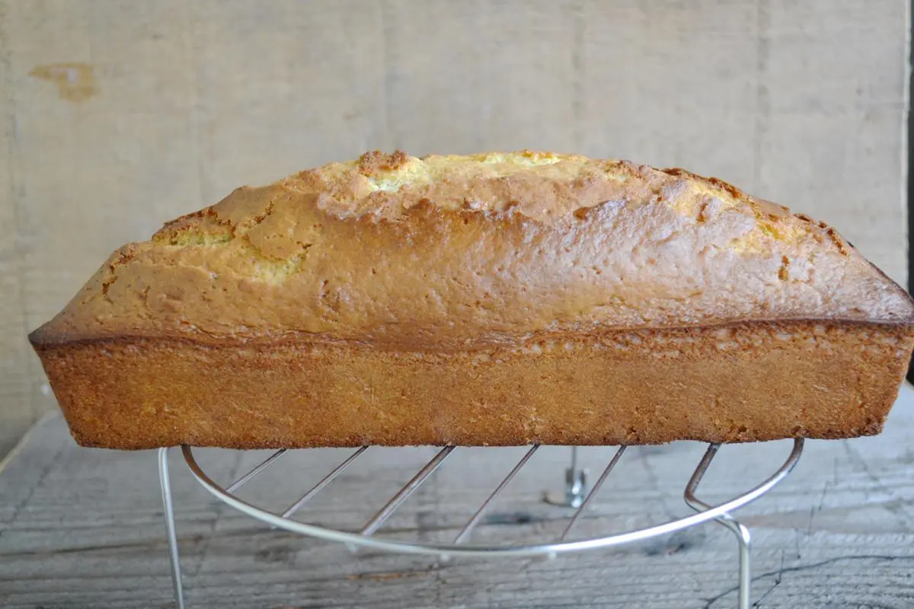

# Plumcake al latticello

{{hi:Latticello}}

## Ingredienti

| Ingredienti                  | Ingredienti             |
| ---------------------------- | ----------------------- |
| **250 g** - Farina 00 | Scorza grattugiata di limone |
| **180 g** - Zucchero di canna | **125 g** - Latticello |
| **3** - Uova | **8 g** - Lievito |
| **80 g** - Olio di semi | **1 pizzico** - Sale |

## Procedimento

> Preriscaldare il forno a 180°

1. In una terrina sbattere con un frullatore le uova con lo zucchero, fino a che non saranno chiare e spumose. 
1. Unire a filo l'olio continuando a miscelare.
1. In un'altra ciotola, unire tutti gli ingredienti secchi: farina, lievito e sale, setacciare per 2 volte.
1. Con l'aiuto di una spatola, incorporare in 3 riprese, alternando prima una parte di farina, poi una parte di latticello. Procedere così fino ad esaurimento degli ingredienti.
1. Imburrare uno stampo da plumcake (da 27cm x 10cm) e versare il composto. Infornare per 30 minuti a 180°C. 
1. Fare raffreddare su una gratella e tagliare con un coltello da pane.
