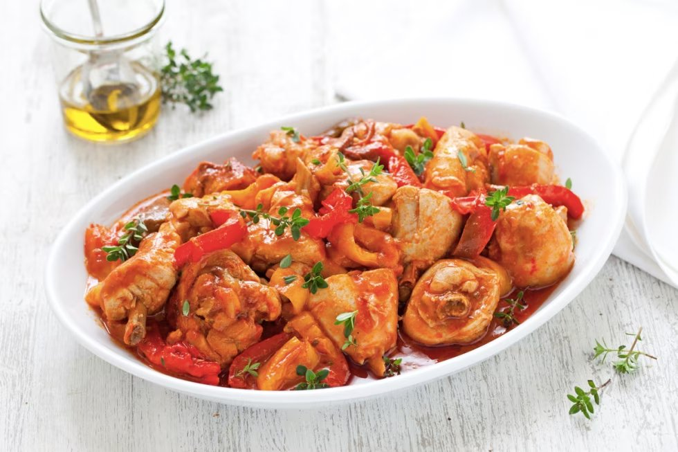

# Pollo ai peperoni

{{hi:Pollo}}
{{hi:Peperoni}}

## Ingredienti

| Ingredienti                  | Ingredienti             |
| ---------------------------- | ----------------------- |
| **800 g** - Pollo a pezzi | **1 spicchio** - Aglio |
| **100 ml** - Polpa di pomodoro | **\\( \frac{1}{2} \\) bicchiere** - Vino bianco secco |
| **1 cucchiaio** - Concentrato di pomodoro | Timo fresco |
| **1** - Peperone rosso | Olio evo |
| **1** - Peperone giallo | Sale e pepe |
| **20 g** - Burro |  |

## Procedimento

1. Mondate i peperoni, eliminate il picciolo, semi e filamenti. Tagliateli a listarelle non troppo fini. 
1. In una casseruola fate rosolare lo spicchio d'aglio nell'olio e nel burro. 
1. Aggiungetevi il pollo a pezzi e fatelo rosolare uniformemente.
1. Sfumate con il vino bianco e lasciate evaporare. 
1. Aggiungete la polpa di pomodoro e il concentrato. 
1. Mescolate per amalgamare e fate insaporire per qualche minuto. 
1. Unite i peperoni, salate, pepate e aggiungete qualche rametto di timo. 
1. Coprite e cuocete a fiamma media per circa 60 minuti.
