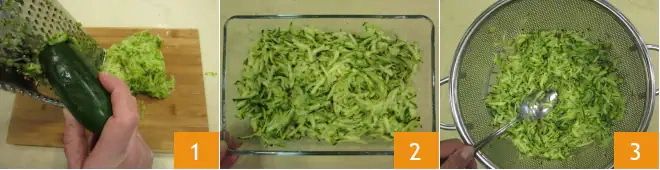
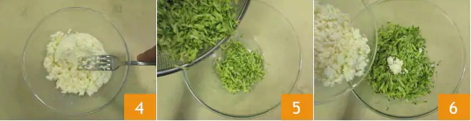
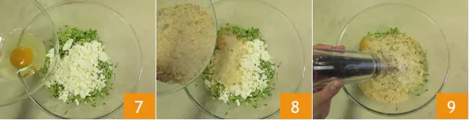
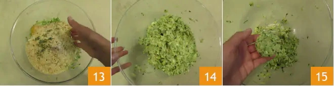
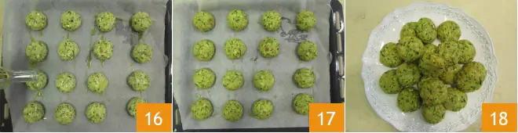

# Polpette di zucchine al forno

{{hi:Zucchine}}
{{hi:Primosale}}

## Ingredienti

| Ingredienti                  | Ingredienti             |
| ---------------------------- | ----------------------- |
| **600 g** - Zucchine | Noce moscata |
| **160 g** - Primosale | Sale fino |
| **1** - Uovo | Pepe nero |
| **130 g** - pangrattato | Timo |

## Procedimento

> Preriscaldare il forno a 190°

1. Per realizzare le polpette di zucchine per prima cosa lavate e asciugate le zucchine, quindi spuntatele e grattugiare le zucchine in modo grossolano, con una grattugia a fori larghi (1-2). Trasferite le zucchine in un colino e schiacciatele bene con un cucchiaio per eliminare la maggior parte di liquido presente (3).
1. Con una forchetta schiacciate il primo sale (4). In una ciotola versate le zucchine (5), il primo sale (6), l'uovo (7), il pangrattato (8), il pepe (9), la noce moscata grattugiata {10}, le foglioline di timo (11) e il sale (12).
1. Lavorate tutti gli ingredienti con le mani (13) ottenendo un composto omogeneo (14). Formate delle palline prelevando una piccola porzione di impasto grande come una noce, schiacciatele leggermente (15). Con questi dosaggi otterrete circa 20 polpette. 
1. Adagiate le polpette su una placca rivestita con carta forno, condite con un filo di olio (16) e cuocete in forno statico preriscaldato a 190° per 15 minuti, o sino a doratura esterna. Sfornate (17), salate leggermente in superficie e servite le vostre polpette di zucchine al forno (18).

