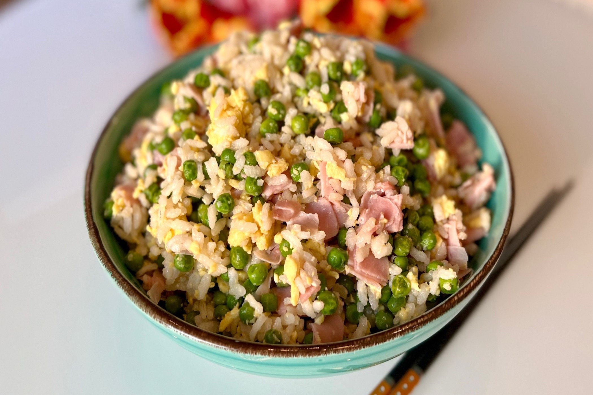

# Riso alla cantonese

{{hi:Piselli}}

## Ingredienti

| Ingredienti                  | Ingredienti             |
| ---------------------------- | ----------------------- |
| **200 g** - Riso bianco | Olio evo |
| **4** - Uova | Ale |
| **300 g** - Piselli | Pepe |
| **200 g** - Prosciutto cotto | Curcuma |
| **5 cucchiai** - Salsa di soia |  |

## Procedimento

1. Per prima cosa pulisci il riso bianco sotto l'acqua corrente e mettilo a bollire per 30 min circa (dipende dalle indicazioni scritte nella confezione, ogni riso è diverso).
1. In una padella metti a cuocere i piselli surgelati con un filo d'olio e acqua per circa 20 minuti (puoi anche cuocerli in acqua).
1. Nel frattempo prepara le uova: aprile in una bowl, aggiungi sale e pepe, olio e curcuma e tutte le spezie che più ti piacciono, sbattile con delle bacchette e versale in una wok calda con un filo d'olio.
1. Ora taglia a dadini il prosciutto cotto.
1. A questo punto hai tutti gli ingredienti pronti per essere assemblati. Unisci alla wok con le uova strapazzate il riso, i piselli, la salsa di soia e il prosciutto. Il segreto per un riso alla cantonese perfetto è mescolare sempre.
1. Versa il tuo riso alla cantonese in una bowl, aggiungi ancora un filo d'olio, sale e pepe, salsa di soia e prendi la tua porzione.
